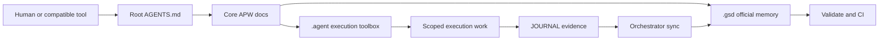

# APW (Agentic Project Workspace) Standard

> **The definitive operational framework for AI-assisted software engineering.**
> Merging the rigorous governance of the *Get-Shit-Done (GSD)* methodology with the advanced execution capabilities of the *Antigravity-Kit (AGK)*.

APW helps people and AI agents build software without losing track of project state, rules, or execution context.

If you are new to APW, you should not have to read half the repo before it makes sense.

This README is the human-facing front door.
Root [AGENTS.md](AGENTS.md) is the zero-touch tool-facing front door.
Together, they give you the short version, then send you through the docs in a beginner-friendly order.

If you want a visual docs experience, APW also includes an in-repo Nextra portal under [`website/`](website/README.md).
The portal is the rendered docs experience, while the repo-root governance files and canonical docs under `docs/` remain the source of truth.
For the explicit documentation model, read [docs/DOCS_SOURCE_OF_TRUTH.md](docs/DOCS_SOURCE_OF_TRUTH.md).

## New Here?

Choose the path that matches what you need:

- I want the shortest safe first-use path:
  [Basic Onboarding Procedure](docs/BASIC_ONBOARDING_PROCEDURE.md)
- I want the visual docs portal:
  [`website/`](website/README.md)
- I am new and want the guided beginner path:
  [APW for Beginners](docs/APW_FOR_BEGINNERS.md) -> [APW Visual Overview](docs/APW_VISUAL_OVERVIEW.md) -> [Idea to Project Guide](docs/IDEA_TO_PROJECT_GUIDE.md) -> [Tech Stack Selection Guide](docs/TECH_STACK_SELECTION_GUIDE.md) -> [Real-World Examples](docs/REAL_WORLD_EXAMPLES.md)
- I want one page that maps the beginner journey:
  [START_HERE.md](docs/START_HERE.md)
- I want to start a real project now:
  [Quick Start](docs/QUICK_START.md)
- I want the easiest way to create a new APW project from anywhere:
  run `/path/to/apw/apw new MyProject --profile base --stack base`
- I want to understand where I should actually work:
  [Where Do I Work?](docs/WHERE_DO_I_WORK.md)
- I want safe helpers for moving between APW root, project roots, and the workspace parent:
  [Safe Context Switching](docs/SAFE_CONTEXT_SWITCHING.md)
- I want to know what to do the first time I open a project in my IDE:
  [First Run In IDE](docs/FIRST_RUN_IN_IDE.md)
- I want to know what happens to `/brainstorm` results after the chat:
  [Brainstorm Persistence and Promotion](docs/BRAINSTORM_PERSISTENCE_AND_PROMOTION.md)
- I want one rule for what core workflow results save and where they go:
  [Workflow Persistence Policy](docs/WORKFLOW_PERSISTENCE_POLICY.md)
- I want to learn how to operate APW workflows:
  [Workflow Selection Guide](docs/WORKFLOW_SELECTION_GUIDE.md) -> [Command Invocation Guide](docs/COMMAND_INVOCATION_GUIDE.md) -> [Agent + Workflow Examples](docs/AGENT_PLUS_WORKFLOW_EXAMPLES.md)
- I want the deeper framework explanation:
  [How APW Works](docs/HOW_APW_WORKS.md) -> [APW Handbook](docs/APW_HANDBOOK.md)

## APW In One Picture



What this means:

- start from `AGENTS.md`
- route into the real APW contract
- use `.agent/` to do the work
- keep official state in `.gsd/`
- record bounded evidence, then let the orchestrator sync canonical state
- use validation and CI to keep the repo healthy

## What APW Is

APW is a framework for running software projects with humans and AI agents in a way that stays organized over time.

It gives you:

- a modern root `AGENTS.md` entrypoint for shared Codex and Antigravity-style tool loading
- a governed project memory layer in `.gsd/`
- an execution layer in `.agent/`
- bootstrap and validation scripts
- rules for how execution work and canonical project state should interact
- CI enforcement so the workspace does not slowly drift

## Workspace Context Model

APW uses one simple operating model across the workspace:

| Location | Role | Typical Actions | Avoid Doing Here |
| :--- | :--- | :--- | :--- |
| `APW root` | framework source and maintenance repo | maintain APW docs, templates, scripts, workflows, and compatibility material; run `apw new`; run bootstrap, validation, or initialization against target repos | normal downstream project implementation |
| `downstream project root` | the real project you are building | open your IDE here; start from `AGENTS.md`; run slash workflows here; edit code and `.gsd` state here | treating it as the source of APW framework templates or validators |
| `workspace parent folder` | organizer for APW plus multiple projects | launch `apw new`; organize sibling repos; move into the project you actually want to work on | day-to-day project workflows unless a helper explicitly supports it |

The practical rule is straightforward:

- create projects from anywhere with `apw new`
- do normal project work in the downstream project root
- use APW root when you intentionally mean to maintain APW itself

If you want the fuller beginner explanation, read [WHERE_DO_I_WORK.md](docs/WHERE_DO_I_WORK.md).

If you want explicit helpers for detecting and switching between those locations, use:

- `apw context`
- `apw list-projects`
- `apw switch framework`
- `apw switch project <name>`
- `apw switch parent`

For the focused guide, read [SAFE_CONTEXT_SWITCHING.md](docs/SAFE_CONTEXT_SWITCHING.md).

## One Framework, Two Tool Paths

APW is one canonical framework.

It does **not** maintain separate `codex` and `antigravity` framework branches.

Instead, APW uses:

- one shared core contract
- one bootstrap system
- one validator
- one documentation system
- one template system
- thin compatibility entrypoints and guidance for different tools

The common model is:

- root `AGENTS.md` is the shared modern front door
- the real APW contract lives in `PROJECT_RULES.md`, `AGENT_SYSTEM.md`, `COMMAND_POLICY.md`, `PROJECT_BOOTSTRAP.md`, and the APW docs/templates
- Codex and Antigravity are supported through that same contract, not through framework forks

For the explicit compatibility model, read [docs/COMPATIBILITY_MODEL.md](docs/COMPATIBILITY_MODEL.md).

That compatibility model also defines the future-migration rule: APW changes structure only through explicit, versioned, coordinated migration, never through silent namespace drift.

## `AGENTS.md`, Codex, and Antigravity Compatibility

APW now supports root `AGENTS.md` as the shared modern entrypoint for both Codex and Antigravity.

This aligns with APW's decision to keep one framework while still supporting tool-specific compatibility needs.

In APW, `AGENTS.md` is a front door, not the entire system. The full governance and workflow model still lives in:

- `PROJECT_RULES.md`
- `AGENT_SYSTEM.md`
- `COMMAND_POLICY.md`
- `PROJECT_BOOTSTRAP.md`
- APW docs, templates, and validators

Compatibility positioning:

- `AGENTS.md`: modern shared front door for tools and people
- `core APW docs`: the real governance and workflow source
- `Codex`: follows APW through `AGENTS.md` plus the core APW contract
- `GEMINI.md`: compatibility path if a repo still needs it
- `Antigravity`: follows the same `AGENTS.md` front door, with `GEMINI.md` compatibility and possible future `.agents/...` migration handled explicitly
- `.agents/...`: newer Antigravity-native pipeline style that APW may adopt later through an explicit migration, not through a silent contract change

For the tool-specific explanations, read:

- [docs/CODEX_COMPATIBILITY.md](docs/CODEX_COMPATIBILITY.md)
- [docs/ANTIGRAVITY_COMPATIBILITY.md](docs/ANTIGRAVITY_COMPATIBILITY.md)
- [docs/COMPATIBILITY_MODEL.md](docs/COMPATIBILITY_MODEL.md)

## Why APW Exists

AI tools are fast, but they drift easily.

Without a framework, projects often end up with:

- unclear current state
- conflicting AI notes
- stale prompts
- random structure drift
- no reliable handoff between sessions or teammates

APW solves that by separating:

- **memory and governance**
- **execution and specialist capability**
- **automation and enforcement**

The short version:

- **GSD** is the brain
- **AGK** is the muscle
- **APW** integrates both into one workspace standard

And when there is a conflict:

**GSD documentation wins.**

---

## 🏗️ Architecture

```text
./apw/
├── AGENTS.md             # Tool-facing entrypoint into the APW contract
├── .agent/              # Execution + capability namespace
│   ├── agents/          # Specialist agent definitions
│   ├── rules/           # Governing prompts and routing rules
│   ├── scripts/         # Task-level automation
│   ├── workflows/       # Execution flows / slash commands
│   └── skills/          # Curated reusable capability library
├── .gsd/                # APW governance workspace (not a downstream template source)
├── docs/                # APW tooling, policies, and guides
├── scripts/             # Bootstrap and validation automation
├── templates/           # Canonical downstream bootstrap source
│   ├── base/.gsd/       # Canonical eight-file lifecycle contract
│   └── advanced/.gsd/   # Same canonical contract plus richer .agent content
├── AGENT_SYSTEM.md      # Dual-engine precedence rules
├── COMMAND_POLICY.md    # Command ownership and naming rules
├── GSD-STYLE.md         # AI communication style guide
├── PROJECT_BOOTSTRAP.md # Bootstrap and upgrade contract
├── PROJECT_RULES.md     # Mandatory execution protocols
└── FILE_CONVENTIONS.md  # Naming and layout constraints
```

---

## 🚀 Quick Start

### Recommended Reading Order

If you want the smoothest beginner path, follow this order:

1. [APW for Beginners](docs/APW_FOR_BEGINNERS.md)
2. [APW Visual Overview](docs/APW_VISUAL_OVERVIEW.md)
3. [Idea to Project Guide](docs/IDEA_TO_PROJECT_GUIDE.md)
4. [Tech Stack Selection Guide](docs/TECH_STACK_SELECTION_GUIDE.md)
5. [Real-World Examples](docs/REAL_WORLD_EXAMPLES.md)
6. [Quick Start](docs/QUICK_START.md)
7. [Workflow Selection Guide](docs/WORKFLOW_SELECTION_GUIDE.md)
8. [Command Invocation Guide](docs/COMMAND_INVOCATION_GUIDE.md)
9. [Agent + Workflow Examples](docs/AGENT_PLUS_WORKFLOW_EXAMPLES.md)

If you want the map for that path in one place, read [START_HERE.md](docs/START_HERE.md).
If you want the shortest safe version of that path, read [BASIC_ONBOARDING_PROCEDURE.md](docs/BASIC_ONBOARDING_PROCEDURE.md).
If you want APW to turn a plain-language brief into the first core `.gsd` drafts, read [GUIDED_PROJECT_STATE_INITIALIZATION.md](docs/GUIDED_PROJECT_STATE_INITIALIZATION.md).
If you want the workspace/project context model, read [WHERE_DO_I_WORK.md](docs/WHERE_DO_I_WORK.md).
If you want the in-IDE first-run path, read [FIRST_RUN_IN_IDE.md](docs/FIRST_RUN_IN_IDE.md).

### Fastest Safe Path

If you want the shortest path to using APW on a new project:

1. Run `apw new` from anywhere in the workspace
2. Let it bootstrap and validate the new repo
3. Move into the downstream project root
4. Open root `AGENTS.md` in the target repo
5. Use [FIRST_RUN_IN_IDE.md](docs/FIRST_RUN_IN_IDE.md) if you want the short in-editor checklist
6. Run the guided project-state initializer
7. Start work from `STATE.md` and `TODO.md`
8. Log bounded evidence in `JOURNAL.md`
9. Sync canonical state deliberately
10. Turn on CI early

### Visual Docs Portal

If you want the rendered docs portal instead of reading Markdown files directly:

1. Go to [`website/`](website/README.md)
2. Run `npm install` inside `website/`
3. Run `npm run dev` inside `website/`
4. Open the local Nextra site and follow the guided beginner path

Portal boundaries:

- `website/` is the presentation layer for the docs experience
- repo-root governance files and `docs/` remain canonical
- portal pages should summarize, route, and improve discoverability without becoming a second governance source

For the practical editing model behind that split, read [docs/DOCS_SOURCE_OF_TRUTH.md](docs/DOCS_SOURCE_OF_TRUTH.md).
For the portal presentation conventions, read [docs/DOCS_VISUAL_STYLE.md](docs/DOCS_VISUAL_STYLE.md).

### Operator Guides

If you want the practical "how do I actually drive work?" layer, start here:

- [Command Invocation Guide](docs/COMMAND_INVOCATION_GUIDE.md)
- [Workflow Selection Guide](docs/WORKFLOW_SELECTION_GUIDE.md)
- [Agent + Workflow Examples](docs/AGENT_PLUS_WORKFLOW_EXAMPLES.md)

These guides explain which command to use, when to use it, which agent to pair with it, what it should read first, and when orchestrator handoff is required.

### Technical And Reference Docs

If you already understand the beginner path and need the framework rules directly, start here:

- [How APW Works](docs/HOW_APW_WORKS.md)
- [APW Handbook](docs/APW_HANDBOOK.md)
- [Compatibility Model](docs/COMPATIBILITY_MODEL.md)
- [First Project Walkthrough](docs/FIRST_PROJECT_WALKTHROUGH.md)
- [Features and Modes](docs/FEATURES_AND_MODES.md)

### For Maintaining the APW Standard
If you are modifying the APW rules themselves, read the [Upgrade Strategy](docs/UPGRADE_STRATEGY.md), the [Command Policy](COMMAND_POLICY.md), and the [Bootstrap Contract](PROJECT_BOOTSTRAP.md).

### Template Contract
- `templates/` is the canonical profile source in the active downstream bootstrap contract, and `base`/`advanced` also receive the shared core command pack from the canonical root `.agent/` tree.
- The canonical downstream `.gsd` contract for `base` and `advanced` is: `SPEC.md`, `ROADMAP.md`, `STATE.md`, `TODO.md`, `JOURNAL.md`, `DECISIONS.md`, `ARCHITECTURE.md`, `STACK.md`.
- `base` and `advanced` receive the shared downstream core command pack directly in `.agent/workflows/`: `/status`, `/brainstorm`, `/create`, `/enhance`, `/debug`, `/test`, `/orchestrate`.
- `advanced` is stronger through richer `.agent/` content, not through extra root `.gsd` state files.
- Canonical state synchronization for `.gsd/STATE.md`, `.gsd/ROADMAP.md`, `.gsd/TODO.md`, and `.gsd/DECISIONS.md` is a controlled orchestrator/governance step, not a routine side effect of execution work.
- Profile-by-profile structure notes live in [templates/README.md](templates/README.md).

### For Developers Starting a New Project
1. Use the workspace-friendly wrapper from anywhere:
   ```bash
   /path/to/apw/apw new MyProject --profile base --stack base
   ```
2. If you want to choose the parent location explicitly:
   ```bash
   /path/to/apw/apw new MyProject --profile base --stack base --target /path/to/MyWork
   ```
3. If you want the one-command path into guided state setup:
   ```bash
   /path/to/apw/apw new MyProject --profile base --stack base --init-state
   ```
4. Use raw bootstrap directly only when you intentionally want the lower-level engine:
   ```bash
   /path/to/apw/scripts/bootstrap.sh --target . --profile base --stack base
   ```
5. Choose a profile intentionally:
   - `minimal`: lightweight lifecycle starter set plus any minimal profile `.agent` content
   - `base`: default downstream bootstrap profile with the standard lifecycle templates plus the shared downstream core workflow pack
   - `advanced`: the same canonical eight-file `.gsd` contract as `base`, plus the shared downstream core workflow pack and extra specialist execution material
6. Validate the repo against the same profile when you use raw bootstrap directly:
   ```bash
   /path/to/apw/scripts/validate.sh . --profile base --stack base
   ```
7. Review the [Downstream Adoption Guide](docs/DOWNSTREAM_ADOPTION_GUIDE.md) and complete the [Downstream Compliance Checklist](docs/DOWNSTREAM_COMPLIANCE_CHECKLIST.md) before coding starts.
8. Enable CI enforcement using [CI/CD Enforcement](docs/CI_CD_ENFORCEMENT.md) and [the example GitHub Actions workflow](examples/github/apw-validate.yml).
9. Start new tool sessions from root `AGENTS.md`, then follow the linked APW files and docs.
10. In `base` and `advanced` downstream repos, use the core APW commands directly from the local `.agent/workflows/` pack.
11. Open your new directory in Cursor/Antigravity and copy the prompt from [PROJECT_INSTANTIATION_PROMPT.md](docs/PROJECT_INSTANTIATION_PROMPT.md) if needed.
12. Generate the first core `.gsd` drafts from your project brief:
   ```bash
   /path/to/apw/scripts/init-project-state.sh --target .
   ```
13. Review the generated state once, then begin implementation work from `.gsd/STATE.md` and `.gsd/TODO.md`.

### For Migrating an Existing Project
1. Start with the [Existing Repo Migration Guide](docs/EXISTING_REPO_MIGRATION_GUIDE.md).
2. Use the [Pilot Adoption Plan](docs/PILOT_ADOPTION_PLAN.md) for phased rollout in an active team.
3. Re-run the [Downstream Compliance Checklist](docs/DOWNSTREAM_COMPLIANCE_CHECKLIST.md) after the first APW-backed feature cycle.

### For Teams
1. Read the [Team Adoption Guide](docs/TEAM_ADOPTION_GUIDE.md).
2. Turn on [CI/CD Enforcement](docs/CI_CD_ENFORCEMENT.md) early.
3. Use the [Downstream Compliance Checklist](docs/DOWNSTREAM_COMPLIANCE_CHECKLIST.md) as a repeatable operating checklist.
4. Before broader rollout, run the [Real User Onboarding Validation Plan](docs/USER_ONBOARDING_VALIDATION_PLAN.md) with the [Onboarding Test Scenarios](docs/ONBOARDING_TEST_SCENARIOS.md) and [User Feedback Template](docs/USER_FEEDBACK_TEMPLATE.md).

---

## 📚 Documentation Map

### Guided Learning Flow

- **[APW for Beginners](docs/APW_FOR_BEGINNERS.md)**: The easiest first explanation for a new or non-technical reader.
- **[APW Visual Overview](docs/APW_VISUAL_OVERVIEW.md)**: A diagram-first view of the APW system and workflow.
- **[Idea to Project Guide](docs/IDEA_TO_PROJECT_GUIDE.md)**: A practical beginner journey from rough idea to structured project start.
- **[Tech Stack Selection Guide](docs/TECH_STACK_SELECTION_GUIDE.md)**: Beginner-friendly help for choosing a likely stack direction and APW profile.
- **[Real-World Examples](docs/REAL_WORLD_EXAMPLES.md)**: Relatable project examples that show how APW would guide real builds.
- **[Basic Onboarding Procedure](docs/BASIC_ONBOARDING_PROCEDURE.md)**: Shortest safe first-use path for a brand-new APW user.
- **[Guided Project-State Initialization](docs/GUIDED_PROJECT_STATE_INITIALIZATION.md)**: The plain-language helper that generates the first drafts of the core `.gsd` files.
- **[Where Do I Work?](docs/WHERE_DO_I_WORK.md)**: The beginner-friendly workspace context model for APW root, downstream project root, and workspace parent folders.
- **[First Run In IDE](docs/FIRST_RUN_IN_IDE.md)**: The beginner-friendly checklist for what to do the first time you open a downstream APW project in your IDE.
- **[Start Here](docs/START_HERE.md)**: First read for a brand-new APW user.
- **[Quick Start](docs/QUICK_START.md)**: Fastest safe path to try APW on a real project.
- **[Command Invocation Guide](docs/COMMAND_INVOCATION_GUIDE.md)**: Command-by-command operator guidance with read-first files, outputs, and orchestrator handoff rules.
- **[Workflow Selection Guide](docs/WORKFLOW_SELECTION_GUIDE.md)**: Beginner-friendly help for choosing the right workflow.
- **[Agent + Workflow Examples](docs/AGENT_PLUS_WORKFLOW_EXAMPLES.md)**: Real invocation patterns using `@agent /workflow task`.
- **[Compatibility Model](docs/COMPATIBILITY_MODEL.md)**: The single-framework compatibility model for Codex and Antigravity.
- **[Codex Compatibility](docs/CODEX_COMPATIBILITY.md)**: How Codex should enter and follow APW.
- **[Antigravity Compatibility](docs/ANTIGRAVITY_COMPATIBILITY.md)**: How `AGENTS.md`, `GEMINI.md`, `.agent/`, and `.agents/` relate in APW.
- **[How APW Works](docs/HOW_APW_WORKS.md)**: The core mental model in plain English.
- **[First Project Walkthrough](docs/FIRST_PROJECT_WALKTHROUGH.md)**: A guided example from bootstrap to first milestone.
- **[Visual Diagrams](docs/DIAGRAMS.md)**: Mermaid diagrams for the APW architecture, flow, and ownership model.
- **[Features and Modes](docs/FEATURES_AND_MODES.md)**: What APW provides and how to apply it in different situations.
- **[Common Workflows](docs/COMMON_WORKFLOWS.md)**: Day-to-day usage patterns for real work.
- **[Real-World Scenarios](docs/REAL_WORLD_SCENARIOS.md)**: Story-style examples of APW in solo, team, migration, advanced, and monorepo settings.

### Deeper Understanding

- **[APW Handbook](docs/APW_HANDBOOK.md)**: Broader end-to-end explanation of APW.
- **[Glossary](docs/GLOSSARY.md)**: Definitions of key APW terms.
- **[Architecture Overview](docs/ARCHITECTURE_OVERVIEW.md)**: The architecture in plain language.
- **[Operating Model](docs/OPERATING_MODEL.md)**: Roles, responsibilities, and controlled canonical state sync.
- **[Use Cases and Examples](docs/USE_CASES_AND_EXAMPLES.md)**: Scenario-driven examples.
- **[Team Adoption Guide](docs/TEAM_ADOPTION_GUIDE.md)**: How teams should adopt and operate APW.
- **[FAQ](docs/FAQ.md)**: Short answers to common questions.

### Maintainer Validation

- **[Real User Onboarding Validation Plan](docs/USER_ONBOARDING_VALIDATION_PLAN.md)**: Practical guide for testing whether real users can onboard into APW successfully.
- **[Onboarding Test Scenarios](docs/ONBOARDING_TEST_SCENARIOS.md)**: Realistic tasks maintainers can run across multiple user types.
- **[User Feedback Template](docs/USER_FEEDBACK_TEMPLATE.md)**: Consistent capture format for confusion, blockers, and improvement ideas.
- **[User Personas](docs/USER_PERSONAS.md)**: Lightweight persona set for choosing balanced onboarding participants.

## 📚 Policy and Contract Reference

- **[Agent System & Precedence](AGENT_SYSTEM.md)**: How GSD and AGK interact.
- **[Command Policy](COMMAND_POLICY.md)**: Which commands own governance versus execution behavior.
- **[Project Bootstrap](PROJECT_BOOTSTRAP.md)**: How APW bootstraps and upgrades repos, including root `AGENTS.md`.
- **[Project Governance Rules](PROJECT_RULES.md)**: The strict rules of execution.
- **[Skill Curation](SKILL_CURATION.md)**: What makes an agent "Core" vs "Add-on".
- **[Template Structure](docs/TEMPLATE_STRUCTURE.md)**: Details on the template contract.
- **[Templates Directory Guide](templates/README.md)**: How `minimal`, `base`, and `advanced` differ at the filesystem level.
- **[Tooling Guide](docs/TOOLING_GUIDE.md)**: Practical operating guidance for Antigravity, Cursor, and Codex.
- **[Downstream Adoption Guide](docs/DOWNSTREAM_ADOPTION_GUIDE.md)**: Day-1 requirements, controlled customization, and safe team usage.
- **[Downstream Compliance Checklist](docs/DOWNSTREAM_COMPLIANCE_CHECKLIST.md)**: The practical checklist for staying APW-compliant after bootstrap.
- **[Existing Repo Migration Guide](docs/EXISTING_REPO_MIGRATION_GUIDE.md)**: How to move an active repository into APW safely.
- **[Monorepo Adaptation](docs/MONOREPO_ADAPTATION.md)**: How to scale APW across packages.
- **[CI/CD Enforcement](docs/CI_CD_ENFORCEMENT.md)**: Concrete downstream validation and pull-request enforcement patterns.
- **[GitHub Actions Example](examples/github/apw-validate.yml)**: Minimal downstream CI workflow that wraps the canonical APW validator.
