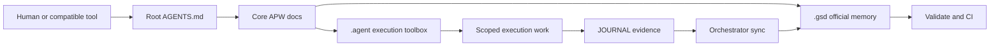

# APW (Agentic Project Workspace) Standard

> **The definitive operational framework for AI-assisted software engineering.**
> Merging the rigorous governance of the *Get-Shit-Done (GSD)* methodology with the advanced execution capabilities of the *Antigravity-Kit (AGK)*.

APW helps people and AI agents build software without losing track of project state, rules, or execution context.

If you are new to APW, you should not have to read half the repo before it makes sense.

This README is the human-facing front door.
Root [AGENTS.md](AGENTS.md) is the zero-touch tool-facing front door.
Root [COMMAND_CHEATSHEET.md](COMMAND_CHEATSHEET.md) is the fast command reference.
Together, they give you the short version, then send you through the docs in a beginner-friendly order.
For the explicit layered reading model, read [docs/DOCUMENTATION_LEVELS.md](docs/DOCUMENTATION_LEVELS.md).

If you want a visual docs experience, APW also includes an in-repo Nextra portal under [`website/`](website/README.md).
The portal is the rendered docs experience, while the repo-root governance files and canonical docs under `docs/` remain the source of truth.
For the explicit documentation model, read [docs/DOCS_SOURCE_OF_TRUTH.md](docs/DOCS_SOURCE_OF_TRUTH.md).

## Canonical Command

APW's canonical terminal entrypoint is `apw`.

Install it once from APW root with `./scripts/install-workspace-launcher.sh`, source the generated `../.apw/env.zsh`, and then use `apw ...` from the workspace parent, APW root, or any downstream APW project.

## New Here?

Choose the documentation level that matches where you are:

### Level 1 — Start Now

Read these now:

- [Installation Guide](docs/INSTALLATION_GUIDE.md)
- [Basic Usage Guide](docs/BASIC_USAGE_GUIDE.md)
- [Basic Onboarding Procedure](docs/BASIC_ONBOARDING_PROCEDURE.md)
- [First Run In IDE](docs/FIRST_RUN_IN_IDE.md)
- [START_HERE.md](docs/START_HERE.md)
- [Command Cheatsheet](COMMAND_CHEATSHEET.md)
- [APW Action Model](docs/APW_ACTION_MODEL.md)

If you want to start a real project immediately:

- `APW: Create Project`
  Terminal fallback: `apw new MyProject --profile base --stack base`
  Default destination:
  from APW root, APW creates `/path/to/workspace/MyProject` beside `apw`; use `--target` to override.
  Chat-first rule:
  APW resolves the current context first and shows the destination before creation instead of silently nesting the repo inside `apw`.

Optional next:

- [Quick Start](docs/QUICK_START.md)
- [Where Do I Work?](docs/WHERE_DO_I_WORK.md)
- [Safe Context Switching](docs/SAFE_CONTEXT_SWITCHING.md)
- [Chat-First Requirement Ingestion](docs/CHAT_FIRST_REQUIREMENT_INGESTION.md)
- [Chat Requirements Flow](docs/CHAT_REQUIREMENTS_TO_EXECUTION_FLOW.md)
- [Chat Requirement Persistence Choices](docs/CHAT_REQUIREMENT_PERSISTENCE_CHOICES.md)
- [Requirement Module Breakdown](docs/REQUIREMENT_MODULE_BREAKDOWN.md)
- [Atomic Implementation Planning](docs/ATOMIC_IMPLEMENTATION_PLANNING.md)

If you want one APW requirement page first instead of opening the focused detail docs separately, start with [Chat Requirements Flow](docs/CHAT_REQUIREMENTS_TO_EXECUTION_FLOW.md).

### Level 2 — Use APW Better

Read these when you want guided support after the repo exists:

- [Idea to Project Guide](docs/IDEA_TO_PROJECT_GUIDE.md)
- [Tech Stack Selection Guide](docs/TECH_STACK_SELECTION_GUIDE.md)
- [Chat-First Requirement Ingestion](docs/CHAT_FIRST_REQUIREMENT_INGESTION.md)
- [Chat Requirements Flow](docs/CHAT_REQUIREMENTS_TO_EXECUTION_FLOW.md)
- [Chat Requirement Persistence Choices](docs/CHAT_REQUIREMENT_PERSISTENCE_CHOICES.md)
- [Requirement Module Breakdown](docs/REQUIREMENT_MODULE_BREAKDOWN.md)
- [Atomic Implementation Planning](docs/ATOMIC_IMPLEMENTATION_PLANNING.md)
- [Workflow Selection Guide](docs/WORKFLOW_SELECTION_GUIDE.md)
- [Command Invocation Guide](docs/COMMAND_INVOCATION_GUIDE.md)
- [Guided Project-State Initialization](docs/GUIDED_PROJECT_STATE_INITIALIZATION.md)
- [Brainstorm Persistence and Promotion](docs/BRAINSTORM_PERSISTENCE_AND_PROMOTION.md)
- [Workflow Persistence Policy](docs/WORKFLOW_PERSISTENCE_POLICY.md)
- [Downstream Project Upgrade](docs/DOWNSTREAM_PROJECT_UPGRADE.md)

### Level 3 — Deep Reference

Read these when you need the framework rules or maintainer detail:

- [How APW Works](docs/HOW_APW_WORKS.md)
- [APW Handbook](docs/APW_HANDBOOK.md)
- [Compatibility Model](docs/COMPATIBILITY_MODEL.md)
- [DOCS_SOURCE_OF_TRUTH.md](docs/DOCS_SOURCE_OF_TRUTH.md)

If you want the visual docs experience instead of raw Markdown, use [`website/`](website/README.md).
If you want the full level map in one place, read [docs/DOCUMENTATION_LEVELS.md](docs/DOCUMENTATION_LEVELS.md).

## APW In One Picture



What this means:

- start from `AGENTS.md`
- route into the real APW contract
- use `.agent/` to do the work
- keep official state in `.gsd/`
- record bounded evidence, then let the orchestrator sync canonical state
- use validation and CI to keep the repo healthy

## What APW Is

APW is a framework for running software projects with humans and AI agents in a way that stays organized over time.

It gives you:

- a modern root `AGENTS.md` entrypoint for shared Codex and Antigravity-style tool loading
- a governed project memory layer in `.gsd/`
- an execution layer in `.agent/`
- bootstrap and validation scripts
- rules for how execution work and canonical project state should interact
- CI enforcement so the workspace does not slowly drift

## Preferred Interaction Path

APW uses one simple interaction hierarchy:

1. chat-first request
2. IDE action or command-palette style action
3. terminal command fallback

This means:

- beginners should prefer the APW action model first
- terminal commands remain available for power users, automation, and exact fallback
- both paths still map to the same APW engine underneath

For the canonical action catalog, read [docs/APW_ACTION_MODEL.md](docs/APW_ACTION_MODEL.md).

For the first beginner layer, start with these three actions:

- `APW: Create Project`
- `APW: Initialize Project State`
- `APW: First Run`

For requirement-bearing chat after the repo exists, APW uses one simple rule:

- classify the chat first
- save a bounded summary to `JOURNAL.md` when needed
- promote official changes deliberately into `SPEC.md`, `TODO.md`, `ROADMAP.md`, or `DECISIONS.md`
- make the persistence outcome explicit: notes only, promote, orchestrator sync, or do not save yet
- when the requirement set is too large for one clean backlog, use `/orchestrate` to break it into modules or workstreams first
- once modules exist, turn the active work into one bounded implementation slice at a time before using `/create`, `/debug`, or `/test`

If you want the whole route in one place, read [docs/CHAT_REQUIREMENTS_TO_EXECUTION_FLOW.md](docs/CHAT_REQUIREMENTS_TO_EXECUTION_FLOW.md).

## Workspace Context Model

APW uses one simple operating model across the workspace:

| Location | Role | Typical Actions | Avoid Doing Here |
| :--- | :--- | :--- | :--- |
| `APW root` | framework source and maintenance repo | maintain APW docs, templates, scripts, workflows, and compatibility material; use `APW: Create Project`; run bootstrap, validation, or initialization against target repos | normal downstream project implementation |
| `downstream project root` | the real project you are building | open your IDE here; start from `AGENTS.md`; run slash workflows here; edit code and `.gsd` state here | treating it as the source of APW framework templates or validators |
| `workspace parent folder` | organizer for APW plus multiple projects | launch `apw new`; organize sibling repos; move into the project you actually want to work on | day-to-day project workflows unless a helper explicitly supports it |

The practical rule is straightforward:

- create projects from anywhere with `apw new`
- from APW root, `apw new` creates sibling downstream repos in the workspace parent by default
- from the workspace parent, `apw new` creates the repo in the current folder by default
- from a downstream project, `apw new` creates a sibling repo in the same workspace parent by default
- chat-first `APW: Create Project` uses that same workspace-aware resolver and shows the chosen destination before creation
- do normal project work in the downstream project root
- use APW root when you intentionally mean to maintain APW itself

If you want the fuller beginner explanation, read [WHERE_DO_I_WORK.md](docs/WHERE_DO_I_WORK.md).

If you want explicit helpers for detecting and switching between those locations, use:

- `APW: Show Context`
- `APW: List Projects`
- `APW: Switch To Framework`
- `APW: Switch To Project`
- `APW: Switch To Parent`
- `APW: Preview Upgrade`

Terminal fallback:

- `apw context`
- `apw list-projects`
- `apw switch framework`
- `apw switch project <name>`
- `apw switch parent`
- `apw upgrade-project <name-or-path> --dry-run`

For the focused guide, read [SAFE_CONTEXT_SWITCHING.md](docs/SAFE_CONTEXT_SWITCHING.md).

## One Framework, Two Tool Paths

APW is one canonical framework.

It does **not** maintain separate `codex` and `antigravity` framework branches.

Instead, APW uses:

- one shared core contract
- one bootstrap system
- one validator
- one documentation system
- one template system
- thin compatibility entrypoints and guidance for different tools

The common model is:

- root `AGENTS.md` is the shared modern front door
- the real APW contract lives in `PROJECT_RULES.md`, `AGENT_SYSTEM.md`, `COMMAND_POLICY.md`, `PROJECT_BOOTSTRAP.md`, and the APW docs/templates
- Codex and Antigravity are supported through that same contract, not through framework forks

For the explicit compatibility model, read [docs/COMPATIBILITY_MODEL.md](docs/COMPATIBILITY_MODEL.md).

That compatibility model also defines the future-migration rule: APW changes structure only through explicit, versioned, coordinated migration, never through silent namespace drift.

## `AGENTS.md`, Codex, and Antigravity Compatibility

APW now supports root `AGENTS.md` as the shared modern entrypoint for both Codex and Antigravity.

This aligns with APW's decision to keep one framework while still supporting tool-specific compatibility needs.

In APW, `AGENTS.md` is a front door, not the entire system. The full governance and workflow model still lives in:

- `PROJECT_RULES.md`
- `AGENT_SYSTEM.md`
- `COMMAND_POLICY.md`
- `PROJECT_BOOTSTRAP.md`
- APW docs, templates, and validators

Compatibility positioning:

- `AGENTS.md`: modern shared front door for tools and people
- `core APW docs`: the real governance and workflow source
- `Codex`: follows APW through `AGENTS.md` plus the core APW contract
- `GEMINI.md`: compatibility path if a repo still needs it
- `Antigravity`: follows the same `AGENTS.md` front door, with `GEMINI.md` compatibility and possible future `.agents/...` migration handled explicitly
- `.agents/...`: newer Antigravity-native pipeline style that APW may adopt later through an explicit migration, not through a silent contract change

For the tool-specific explanations, read:

- [docs/CODEX_COMPATIBILITY.md](docs/CODEX_COMPATIBILITY.md)
- [docs/ANTIGRAVITY_COMPATIBILITY.md](docs/ANTIGRAVITY_COMPATIBILITY.md)
- [docs/COMPATIBILITY_MODEL.md](docs/COMPATIBILITY_MODEL.md)

## Why APW Exists

AI tools are fast, but they drift easily.

Without a framework, projects often end up with:

- unclear current state
- conflicting AI notes
- stale prompts
- random structure drift
- no reliable handoff between sessions or teammates

APW solves that by separating:

- **memory and governance**
- **execution and specialist capability**
- **automation and enforcement**

The short version:

- **GSD** is the brain
- **AGK** is the muscle
- **APW** integrates both into one workspace standard

And when there is a conflict:

**GSD documentation wins.**

---

## 🏗️ Architecture

```text
./apw/
├── AGENTS.md             # Tool-facing entrypoint into the APW contract
├── COMMAND_CHEATSHEET.md # Fast APW command reference
├── .agent/              # Execution + capability namespace
│   ├── agents/          # Specialist agent definitions
│   ├── rules/           # Governing prompts and routing rules
│   ├── scripts/         # Task-level automation
│   ├── workflows/       # Execution flows / slash commands
│   └── skills/          # Curated reusable capability library
├── .gsd/                # APW governance workspace (not a downstream template source)
├── docs/                # APW tooling, policies, and guides
├── scripts/             # Bootstrap and validation automation
├── templates/           # Canonical downstream bootstrap source
│   ├── base/.gsd/       # Canonical eight-file lifecycle contract
│   └── advanced/.gsd/   # Same canonical contract plus richer .agent content
├── AGENT_SYSTEM.md      # Dual-engine precedence rules
├── COMMAND_POLICY.md    # Command ownership and naming rules
├── GSD-STYLE.md         # AI communication style guide
├── PROJECT_BOOTSTRAP.md # Bootstrap and upgrade contract
├── PROJECT_RULES.md     # Mandatory execution protocols
└── FILE_CONVENTIONS.md  # Naming and layout constraints
```

---

## 🚀 Quick Start

### Recommended Reading Order

Use the APW levels instead of trying to read everything in one pass:

1. Level 1 now:
   [INSTALLATION_GUIDE.md](docs/INSTALLATION_GUIDE.md) -> [BASIC_USAGE_GUIDE.md](docs/BASIC_USAGE_GUIDE.md) -> [BASIC_ONBOARDING_PROCEDURE.md](docs/BASIC_ONBOARDING_PROCEDURE.md) -> [FIRST_RUN_IN_IDE.md](docs/FIRST_RUN_IN_IDE.md) -> [COMMAND_CHEATSHEET.md](COMMAND_CHEATSHEET.md)
2. Level 2 next, only when needed:
   [GUIDED_PROJECT_STATE_INITIALIZATION.md](docs/GUIDED_PROJECT_STATE_INITIALIZATION.md) -> [WORKFLOW_SELECTION_GUIDE.md](docs/WORKFLOW_SELECTION_GUIDE.md) -> [COMMAND_INVOCATION_GUIDE.md](docs/COMMAND_INVOCATION_GUIDE.md)
3. Level 3 later:
   [HOW_APW_WORKS.md](docs/HOW_APW_WORKS.md) -> [APW_HANDBOOK.md](docs/APW_HANDBOOK.md) -> [COMPATIBILITY_MODEL.md](docs/COMPATIBILITY_MODEL.md)

If you want the level map in one place, read [DOCUMENTATION_LEVELS.md](docs/DOCUMENTATION_LEVELS.md).
If you want the map for the Level 1 path, read [START_HERE.md](docs/START_HERE.md).

### Fastest Safe Path

If you want the shortest path to using APW on a new project:

1. Read [INSTALLATION_GUIDE.md](docs/INSTALLATION_GUIDE.md)
2. Read [BASIC_USAGE_GUIDE.md](docs/BASIC_USAGE_GUIDE.md)
3. Use `APW: Create Project`
4. Let it bootstrap and validate the new repo
5. Move into the downstream project root
6. Open root `AGENTS.md` in the target repo
7. Read [FIRST_RUN_IN_IDE.md](docs/FIRST_RUN_IN_IDE.md)
8. Keep [COMMAND_CHEATSHEET.md](COMMAND_CHEATSHEET.md) nearby if you want the command names fast
9. Use `APW: Initialize Project State`
10. Start work from `STATE.md` and `TODO.md`
11. Log bounded evidence in `JOURNAL.md`
12. Sync canonical state deliberately

### Visual Docs Portal

If you want the rendered docs portal instead of reading Markdown files directly:

1. Go to [`website/`](website/README.md)
2. Run `npm install` inside `website/`
3. Run `npm run dev` inside `website/`
4. Open the local Nextra site and follow the guided beginner path

Portal boundaries:

- `website/` is the presentation layer for the docs experience
- repo-root governance files and `docs/` remain canonical
- portal pages should summarize, route, and improve discoverability without becoming a second governance source

For the practical editing model behind that split, read [docs/DOCS_SOURCE_OF_TRUTH.md](docs/DOCS_SOURCE_OF_TRUTH.md).
For the portal presentation conventions, read [docs/DOCS_VISUAL_STYLE.md](docs/DOCS_VISUAL_STYLE.md).

### Operator Guides

If you want the practical "how do I actually drive work?" layer, start here:

- [Command Invocation Guide](docs/COMMAND_INVOCATION_GUIDE.md)
- [Workflow Selection Guide](docs/WORKFLOW_SELECTION_GUIDE.md)
- [Agent + Workflow Examples](docs/AGENT_PLUS_WORKFLOW_EXAMPLES.md)

These guides explain which command to use, when to use it, which agent to pair with it, what it should read first, and when orchestrator handoff is required.

### Technical And Reference Docs

If you already understand the beginner path and need the framework rules directly, start here:

- [How APW Works](docs/HOW_APW_WORKS.md)
- [APW Handbook](docs/APW_HANDBOOK.md)
- [Compatibility Model](docs/COMPATIBILITY_MODEL.md)
- [First Project Walkthrough](docs/FIRST_PROJECT_WALKTHROUGH.md)
- [Features and Modes](docs/FEATURES_AND_MODES.md)

### For Maintaining the APW Standard
If you are modifying the APW rules themselves, read the [Upgrade Strategy](docs/UPGRADE_STRATEGY.md), the [Command Policy](COMMAND_POLICY.md), and the [Bootstrap Contract](PROJECT_BOOTSTRAP.md).

### Template Contract
- `templates/` is the canonical profile source in the active downstream bootstrap contract, and `base`/`advanced` also receive the shared core command pack from the canonical root `.agent/` tree.
- The canonical downstream `.gsd` contract for `base` and `advanced` is: `SPEC.md`, `ROADMAP.md`, `STATE.md`, `TODO.md`, `JOURNAL.md`, `DECISIONS.md`, `ARCHITECTURE.md`, `STACK.md`.
- `base` and `advanced` receive the shared downstream core command pack directly in `.agent/workflows/`: `/status`, `/brainstorm`, `/create`, `/enhance`, `/debug`, `/test`, `/orchestrate`.
- `advanced` is stronger through richer `.agent/` content, not through extra root `.gsd` state files.
- Canonical state synchronization for `.gsd/STATE.md`, `.gsd/ROADMAP.md`, `.gsd/TODO.md`, and `.gsd/DECISIONS.md` is a controlled orchestrator/governance step, not a routine side effect of execution work.
- Profile-by-profile structure notes live in [templates/README.md](templates/README.md).

### For Developers Starting a New Project
1. Use the workspace-friendly wrapper from anywhere:
   ```bash
   apw new MyProject --profile base --stack base
   ```
   Default destination policy:
   - from APW root, the new repo is created in the parent workspace beside `apw`
   - from the workspace parent, the new repo is created in the current folder
   - from a downstream project, the new repo is created as a sibling in the same workspace parent
   - use `--target /path/to/parent` when you want a different parent location
2. If you want to choose the parent location explicitly:
   ```bash
   apw new MyProject --profile base --stack base --target /path/to/MyWork
   ```
3. If you want the one-command path into guided state setup:
   ```bash
   apw new MyProject --profile base --stack base --init-state
   ```
4. Use raw bootstrap directly only when you intentionally want the lower-level engine:
   ```bash
   /path/to/apw/scripts/bootstrap.sh --target . --profile base --stack base
   ```
5. Choose a profile intentionally:
   - `minimal`: lightweight lifecycle starter set plus any minimal profile `.agent` content
   - `base`: default downstream bootstrap profile with the standard lifecycle templates plus the shared downstream core workflow pack
   - `advanced`: the same canonical eight-file `.gsd` contract as `base`, plus the shared downstream core workflow pack and extra specialist execution material
6. Validate the repo against the same profile when you use raw bootstrap directly:
   ```bash
   /path/to/apw/scripts/validate.sh . --profile base --stack base
   ```
7. Review the [Downstream Adoption Guide](docs/DOWNSTREAM_ADOPTION_GUIDE.md) and complete the [Downstream Compliance Checklist](docs/DOWNSTREAM_COMPLIANCE_CHECKLIST.md) before coding starts.
8. Enable CI enforcement using [CI/CD Enforcement](docs/CI_CD_ENFORCEMENT.md) and [the example GitHub Actions workflow](examples/github/apw-validate.yml).
9. Start new tool sessions from root `AGENTS.md`, then follow the linked APW files and docs.
10. In `base` and `advanced` downstream repos, use the core APW commands directly from the local `.agent/workflows/` pack.
11. Open your new directory in Cursor/Antigravity and copy the prompt from [PROJECT_INSTANTIATION_PROMPT.md](docs/PROJECT_INSTANTIATION_PROMPT.md) if needed.
12. Generate the first core `.gsd` drafts from your project brief:
   ```bash
   /path/to/apw/scripts/init-project-state.sh --target .
   ```
13. Review the generated state once, then begin implementation work from `.gsd/STATE.md` and `.gsd/TODO.md`.
14. If the current TODO item is still too large, use `/orchestrate` to turn it into atomic slices before direct execution.

### For Migrating an Existing Project
1. Start with the [Existing Repo Migration Guide](docs/EXISTING_REPO_MIGRATION_GUIDE.md).
2. Use the [Pilot Adoption Plan](docs/PILOT_ADOPTION_PLAN.md) for phased rollout in an active team.
3. Re-run the [Downstream Compliance Checklist](docs/DOWNSTREAM_COMPLIANCE_CHECKLIST.md) after the first APW-backed feature cycle.

### For Teams
1. Read the [Team Adoption Guide](docs/TEAM_ADOPTION_GUIDE.md).
2. Turn on [CI/CD Enforcement](docs/CI_CD_ENFORCEMENT.md) early.
3. Use the [Downstream Compliance Checklist](docs/DOWNSTREAM_COMPLIANCE_CHECKLIST.md) as a repeatable operating checklist.
4. Before broader rollout, run the [Real User Onboarding Validation Plan](docs/USER_ONBOARDING_VALIDATION_PLAN.md) with the [Onboarding Test Scenarios](docs/ONBOARDING_TEST_SCENARIOS.md) and [User Feedback Template](docs/USER_FEEDBACK_TEMPLATE.md).

---

## 📚 Documentation Map

### Level 1 — Start Now

- **[Installation Guide](docs/INSTALLATION_GUIDE.md)**: what you need installed and how to verify APW works locally
- **[Basic Usage Guide](docs/BASIC_USAGE_GUIDE.md)**: shortest safe first-use path after APW is installed
- **[Basic Onboarding Procedure](docs/BASIC_ONBOARDING_PROCEDURE.md)**: shortest safe first-use path
- **[First Run In IDE](docs/FIRST_RUN_IN_IDE.md)**: what to do after opening a downstream project
- **[Start Here](docs/START_HERE.md)**: guided map for the beginner journey
- **[Quick Start](docs/QUICK_START.md)**: fastest safe path to try APW on a real project
- **[Command Cheatsheet](COMMAND_CHEATSHEET.md)**: one-minute command reference
- **[APW Action Model](docs/APW_ACTION_MODEL.md)**: the chat-first and IDE-friendly interaction model
- **[Chat Requirements Flow](docs/CHAT_REQUIREMENTS_TO_EXECUTION_FLOW.md)**: the end-to-end route from requirement chat to execution
- **[Atomic Implementation Planning](docs/ATOMIC_IMPLEMENTATION_PLANNING.md)**: turn modules into bounded implementation slices for `/create`, `/debug`, and `/test`

### Level 2 — Use APW Better

- **[Idea to Project Guide](docs/IDEA_TO_PROJECT_GUIDE.md)**: turn a rough idea into a structured project path
- **[Tech Stack Selection Guide](docs/TECH_STACK_SELECTION_GUIDE.md)**: choose a likely stack direction and APW profile
- **[Guided Project-State Initialization](docs/GUIDED_PROJECT_STATE_INITIALIZATION.md)**: generate the first drafts of the core `.gsd` files
- **[Where Do I Work?](docs/WHERE_DO_I_WORK.md)**: workspace context model for APW root, project roots, and workspace parent folders
- **[Safe Context Switching](docs/SAFE_CONTEXT_SWITCHING.md)**: explicit helpers for moving between workspace contexts
- **[Workflow Selection Guide](docs/WORKFLOW_SELECTION_GUIDE.md)**: choose the right workflow
- **[Command Invocation Guide](docs/COMMAND_INVOCATION_GUIDE.md)**: read-first context, outputs, and orchestrator handoff
- **[Agent + Workflow Examples](docs/AGENT_PLUS_WORKFLOW_EXAMPLES.md)**: real invocation patterns
- **[Brainstorm Persistence and Promotion](docs/BRAINSTORM_PERSISTENCE_AND_PROMOTION.md)**: safe save/promote rules for brainstorm work
- **[Workflow Persistence Policy](docs/WORKFLOW_PERSISTENCE_POLICY.md)**: APW-wide save/promote rules across core workflows
- **[Chat Requirements Flow](docs/CHAT_REQUIREMENTS_TO_EXECUTION_FLOW.md)**: the unified route from chat intake through persistence, modules, slices, and workflows
- **[Atomic Implementation Planning](docs/ATOMIC_IMPLEMENTATION_PLANNING.md)**: turn modules into bounded execution slices before routine implementation expands
- **[Downstream Project Upgrade](docs/DOWNSTREAM_PROJECT_UPGRADE.md)**: safe preview-first downstream upgrade flow
- **[Real-World Examples](docs/REAL_WORLD_EXAMPLES.md)**: relatable project examples

### Level 3 — Deep Reference

- **[How APW Works](docs/HOW_APW_WORKS.md)**: the deeper mental model
- **[APW Handbook](docs/APW_HANDBOOK.md)**: broader end-to-end explanation
- **[Compatibility Model](docs/COMPATIBILITY_MODEL.md)**: single-framework compatibility model
- **[Codex Compatibility](docs/CODEX_COMPATIBILITY.md)**: Codex-specific entry and usage
- **[Antigravity Compatibility](docs/ANTIGRAVITY_COMPATIBILITY.md)**: Antigravity/AGK compatibility detail
- **[First Project Walkthrough](docs/FIRST_PROJECT_WALKTHROUGH.md)**: guided example from bootstrap to first milestone
- **[Visual Diagrams](docs/DIAGRAMS.md)**: architecture, flow, and ownership diagrams
- **[Features and Modes](docs/FEATURES_AND_MODES.md)**: APW features and usage modes
- **[Common Workflows](docs/COMMON_WORKFLOWS.md)**: day-to-day usage patterns
- **[Real-World Scenarios](docs/REAL_WORLD_SCENARIOS.md)**: story-style APW scenarios
- **[APW Handbook](docs/APW_HANDBOOK.md)**, **[Glossary](docs/GLOSSARY.md)**, **[Architecture Overview](docs/ARCHITECTURE_OVERVIEW.md)**, **[Operating Model](docs/OPERATING_MODEL.md)**, **[Use Cases and Examples](docs/USE_CASES_AND_EXAMPLES.md)**, **[FAQ](docs/FAQ.md)**: broader reference layer

### Maintainer / Validation Layer

- **[Real User Onboarding Validation Plan](docs/USER_ONBOARDING_VALIDATION_PLAN.md)**: test whether real users can onboard successfully
- **[Onboarding Test Scenarios](docs/ONBOARDING_TEST_SCENARIOS.md)**: realistic onboarding tasks
- **[User Feedback Template](docs/USER_FEEDBACK_TEMPLATE.md)**: consistent feedback capture
- **[User Personas](docs/USER_PERSONAS.md)**: participant balancing aid

## 📚 Policy and Contract Reference

- **[Agent System & Precedence](AGENT_SYSTEM.md)**: How GSD and AGK interact.
- **[Command Policy](COMMAND_POLICY.md)**: Which commands own governance versus execution behavior.
- **[Project Bootstrap](PROJECT_BOOTSTRAP.md)**: How APW bootstraps and upgrades repos, including root `AGENTS.md`.
- **[Project Governance Rules](PROJECT_RULES.md)**: The strict rules of execution.
- **[Skill Curation](SKILL_CURATION.md)**: What makes an agent "Core" vs "Add-on".
- **[Template Structure](docs/TEMPLATE_STRUCTURE.md)**: Details on the template contract.
- **[Templates Directory Guide](templates/README.md)**: How `minimal`, `base`, and `advanced` differ at the filesystem level.
- **[Tooling Guide](docs/TOOLING_GUIDE.md)**: Practical operating guidance for Antigravity, Cursor, and Codex.
- **[Downstream Adoption Guide](docs/DOWNSTREAM_ADOPTION_GUIDE.md)**: Day-1 requirements, controlled customization, and safe team usage.
- **[Downstream Compliance Checklist](docs/DOWNSTREAM_COMPLIANCE_CHECKLIST.md)**: The practical checklist for staying APW-compliant after bootstrap.
- **[Downstream Project Upgrade](docs/DOWNSTREAM_PROJECT_UPGRADE.md)**: The safe preview-first way to refresh APW-managed files in an existing downstream repo.
- **[Existing Repo Migration Guide](docs/EXISTING_REPO_MIGRATION_GUIDE.md)**: How to move an active repository into APW safely.
- **[Monorepo Adaptation](docs/MONOREPO_ADAPTATION.md)**: How to scale APW across packages.
- **[CI/CD Enforcement](docs/CI_CD_ENFORCEMENT.md)**: Concrete downstream validation and pull-request enforcement patterns.
- **[GitHub Actions Example](examples/github/apw-validate.yml)**: Minimal downstream CI workflow that wraps the canonical APW validator.
