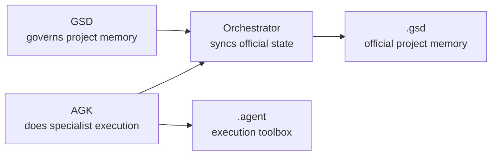

# APW_FOR_BEGINNERS.md — APW for Beginners

> [!IMPORTANT]
> Read this if you are new to APW and want the simple, human version before you open the deeper docs.

## What is APW?

APW stands for **Agentic Project Workspace**.

It is a way to organize software projects so humans and AI agents can work together without losing track of what the project is doing, what changed, and what should happen next.

In plain English:

- APW gives the project a memory
- APW gives agents a place to work
- APW gives the team a way to keep that work aligned over time

If you have ever seen an AI coding session go well for 20 minutes and then become messy, forgetful, or inconsistent, APW exists to reduce that problem.

## Why APW exists

AI tools are powerful, but software projects usually last much longer than a single chat.

Without a shared structure, teams often end up with:

- unclear requirements
- no trustworthy current status
- conflicting notes from different sessions
- code changes that are hard to explain later
- repos that slowly drift away from their original plan

APW exists to keep the project understandable as it grows.

It does that by separating:

- project memory
- execution work
- validation and enforcement

That separation is what makes APW feel more like a repeatable system and less like a pile of prompts.

## What problems does APW solve?

APW helps solve practical problems such as:

- "We used an AI tool yesterday, but today nobody knows what state the project is in."
- "The code changed, but there is no clean record of why."
- "Different tools are giving different answers because they are loading different context."
- "The repo worked at first, then slowly drifted into chaos."
- "We want AI assistance, but we do not want random undocumented changes to become the project plan."

APW does not solve every engineering problem.

What it does very well is create a stable working environment where AI help stays tied to project memory, validation, and deliberate coordination.

## The APW team model

APW is easiest to understand if you think of it as a small team with different jobs.

What this means:

- GSD protects the project's official understanding
- AGK gives the project practical execution power
- the orchestrator keeps official state changes controlled
- `.gsd/` stores trusted memory while `.agent/` stores execution support

### GSD

**GSD** is the governance side.

It decides the official project memory:

- what the project is trying to do
- what phase it is in
- what is on the canonical task list
- what counts as done

If APW were a real team, GSD would be the person protecting the plan and the shared understanding.

### AGK

**AGK** is the execution side.

It gives you specialist agents, workflows, and skills for doing the work itself:

- building features
- debugging
- testing
- improving code
- preparing previews or deployments

If GSD is the planner and memory keeper, AGK is the builder.

### Orchestrator

The **orchestrator** is the coordinator.

It looks at the current state, helps decide what should happen next, and performs controlled synchronization when official project memory needs to change.

That matters because APW does **not** want every execution agent casually rewriting the canonical project summary.

### `.gsd`

`.gsd/` is the governed memory layer.

This is where APW stores the project's official memory:

- `SPEC.md`
- `ROADMAP.md`
- `STATE.md`
- `TODO.md`
- `JOURNAL.md`
- `DECISIONS.md`
- `ARCHITECTURE.md`
- `STACK.md`

You can think of `.gsd/` as the project notebook that the team agrees to trust.

### `.agent`

`.agent/` is the execution layer.

This is where APW keeps the things that help agents do work:

- agents
- rules
- workflows
- scripts
- skills

You can think of `.agent/` as the project toolbox.

## How APW works in simple steps

Here is the basic APW flow in plain English.

### 1. Idea

You start with a product idea, a problem to solve, or a project you want to organize better.

Example:

"We want to build a small web app for appointment booking."

### 2. Plan

Before everything becomes code, APW encourages you to define what the project is and what matters first.

That planning eventually lives in the `.gsd/` memory files.

### 3. Bootstrap

You run APW bootstrap to create the workspace structure.

That gives the repo:

- root `AGENTS.md`
- APW governance files
- the `.gsd/` memory layer
- the `.agent/` execution layer

### 4. Validate

You run validation right away.

This checks that the repo really matches the APW contract instead of only looking correct at a glance.

### 5. Implementation

Now specialist agents can do focused work such as:

- creating a feature
- debugging a bug
- improving a screen
- testing an integration

They work inside the APW rules instead of improvising the whole system.

### 6. Journal and evidence

Execution agents may add bounded evidence to `.gsd/JOURNAL.md`.

That means the project keeps a usable record of what happened without treating every raw execution note as the official project summary.

### 7. Orchestrator sync

When the official state needs to change, the orchestrator or a governance pass updates the canonical files deliberately.

This is one of APW's most important ideas:

- execution work can move fast
- canonical memory should move carefully

### 8. CI and ongoing work

Once the repo is working, APW uses validation and CI to keep the structure from drifting over time.

That means APW is not just a one-time setup.
It is a way to keep the project healthy as more work happens.

## A simple comparison

Without APW:

- one chat says the feature is done
- another chat says it still needs work
- the repo has no clear current state
- the next person has to guess what is true

With APW:

- the project has canonical memory
- the execution layer has a clear place to operate
- evidence is recorded in a bounded way
- official state changes are synchronized deliberately

That does not make the project magically easy.

It does make the project much easier to understand and continue.

## What APW helps you do

APW helps you:

- start a project with structure instead of prompt chaos
- keep AI sessions aligned with a shared project memory
- hand work between sessions or teammates more safely
- separate implementation evidence from official status
- validate that the repo still matches the intended contract
- support tools like Codex and Antigravity without forking the framework

## Who is APW for?

APW is useful for:

- solo builders who want better project memory
- product teams using AI coding tools repeatedly
- technical leads who want clearer handoff and less drift
- beginners who want a safer structure around AI-assisted development
- teams adopting AI workflows without giving up governance

You do **not** need to be deeply technical to understand what APW is for.

The more technical pieces matter later.
At the beginning, the main idea is simple:

APW helps a project stay coherent while people and agents work on it.

## Example journey

Here is a simple first-time journey.

You have an idea for a booking app.

1. You bootstrap a new repo with APW.
2. You validate the repo so the structure is real.
3. You open root `AGENTS.md` and follow the APW docs.
4. You write the first project memory into `.gsd/`.
5. A specialist agent builds the first booking flow.
6. The agent adds bounded evidence to `JOURNAL.md`.
7. The orchestrator updates the official state and next tasks.
8. CI keeps checking that the project still matches the APW contract.

The important thing is not that APW adds more files.

The important thing is that those files give the project continuity.

## The shortest mental model

If you only remember five things, remember these:

1. `AGENTS.md` is the front door.
2. `.gsd/` is the project's official memory.
3. `.agent/` is the execution toolbox.
4. Execution agents can add evidence, but not casually rewrite canonical state.
5. The orchestrator keeps official state synchronization controlled.

## What should I read next?

Choose the next step that matches you:

- If you want the simplest visual explanation, read [APW_VISUAL_OVERVIEW.md](./APW_VISUAL_OVERVIEW.md).
- If you want the step-by-step journey from idea to structured project, read [IDEA_TO_PROJECT_GUIDE.md](./IDEA_TO_PROJECT_GUIDE.md).
- If you want help choosing a likely stack direction and APW profile, read [TECH_STACK_SELECTION_GUIDE.md](./TECH_STACK_SELECTION_GUIDE.md).
- If you want to see what APW looks like on real project ideas, read [REAL_WORLD_EXAMPLES.md](./REAL_WORLD_EXAMPLES.md).
- If you want the fastest safe hands-on path, read [QUICK_START.md](./QUICK_START.md).
- If you want the plain-English system explanation, read [HOW_APW_WORKS.md](./HOW_APW_WORKS.md).
- If you want to see a realistic first run, read [FIRST_PROJECT_WALKTHROUGH.md](./FIRST_PROJECT_WALKTHROUGH.md).
- If you want the deeper full explanation, read [APW_HANDBOOK.md](./APW_HANDBOOK.md).

If you are using a compatible tool directly, root `AGENTS.md` is still the operational front door.
