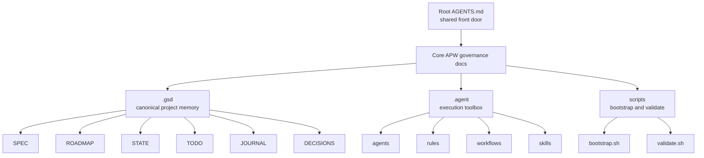
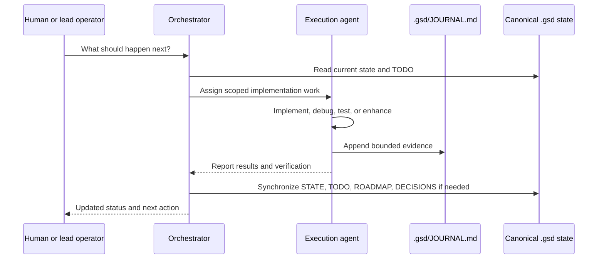
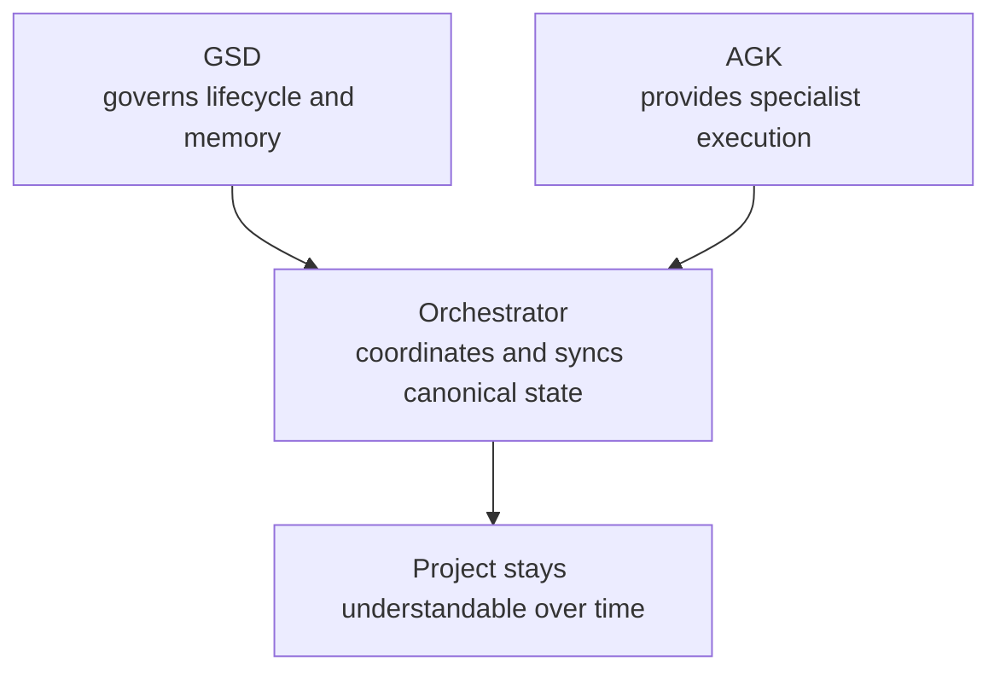

# APW_VISUAL_OVERVIEW.md — APW Visual Overview

> [!TIP]
> Read this if APW makes more sense to you when you can see the system as a set of diagrams instead of a wall of text.

## Visual overview

APW is easier to understand when you picture it as three things happening at once:

- one layer keeps the project's memory
- one layer helps agents do the work
- one coordinator keeps official state changes controlled

The diagrams below show that model from a few angles.

## Diagram 1: APW architecture overview

What this means:

- `AGENTS.md` is how tools and readers enter the system
- the core APW docs define the rules
- `.gsd/` stores the official project memory
- `.agent/` stores the execution-side helpers
- `bootstrap.sh` and `validate.sh` enforce the structure

## Diagram 2: From idea to ongoing project work

What this means:

- APW is not just "write code with AI"
- it gives the project a repeatable flow
- implementation is only one part of the system
- state synchronization and CI are what keep the structure trustworthy over time

## Diagram 3: Execution agent vs orchestrator

What this means:

- execution agents do the work
- they may record bounded evidence in `JOURNAL.md`
- they should not casually rewrite the canonical summary files
- the orchestrator handles official synchronization when project memory must change

## Diagram 4: APW as a team model

What this means:

- GSD protects the official project understanding
- AGK gives the project execution strength
- the orchestrator connects those layers so the project does not split into raw implementation noise on one side and stale planning on the other

## Key takeaways

If you only remember the diagrams loosely, remember this:

- `AGENTS.md` is the front door
- `.gsd/` is the trusted project memory
- `.agent/` is the execution toolbox
- execution agents can move quickly, but canonical state changes are controlled
- APW keeps the system stable with bootstrap, validation, and CI

## Read next

- For the plain-English beginner explanation, read [APW_FOR_BEGINNERS.md](./APW_FOR_BEGINNERS.md).
- For the journey from idea to structured project start, read [IDEA_TO_PROJECT_GUIDE.md](./IDEA_TO_PROJECT_GUIDE.md).
- For choosing a likely stack direction and profile, read [TECH_STACK_SELECTION_GUIDE.md](./TECH_STACK_SELECTION_GUIDE.md).
- For the fastest safe hands-on path, read [QUICK_START.md](./QUICK_START.md).
- For the next practical explanation layer, read [HOW_APW_WORKS.md](./HOW_APW_WORKS.md).
- For a realistic walkthrough, read [FIRST_PROJECT_WALKTHROUGH.md](./FIRST_PROJECT_WALKTHROUGH.md).
- For day-to-day usage once you are oriented, read [COMMAND_INVOCATION_GUIDE.md](./COMMAND_INVOCATION_GUIDE.md).
