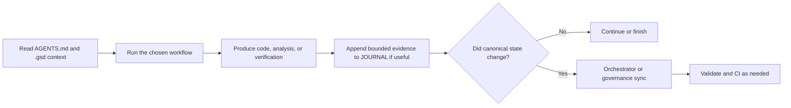

# COMMAND_INVOCATION_GUIDE.md — Practical Command Invocation Guide

> [!TIP]
> Read this when you want the practical answer to: "Which APW command should I run, what should it read, and what should happen next?"

## What this guide is

This is the operator-facing guide for APW execution workflows.

It explains how to drive real work in tools such as Antigravity, Codex, and Cursor without guessing:

- which command to use
- what it should read first
- what it should produce
- when it should stop and hand work to the orchestrator

## Workspace context note

Use the commands in this guide from the downstream project root.

That is the location where:

- the project's `AGENTS.md` exists
- the project's `.gsd/` memory exists
- the project's local `.agent/workflows/` pack exists

Use APW root for framework maintenance and workspace-level helper commands.
Use the workspace parent folder mainly as an organizer or launch point.

If you want the short beginner version of that model, read [WHERE_DO_I_WORK.md](./WHERE_DO_I_WORK.md).
If you want the explicit switch helpers, read [SAFE_CONTEXT_SWITCHING.md](./SAFE_CONTEXT_SWITCHING.md).
If you want the first-run IDE checklist first, read [FIRST_RUN_IN_IDE.md](./FIRST_RUN_IN_IDE.md).

## Important scope note

These core workflows are vendored into downstream `base` and `advanced` repos under `.agent/workflows/`.

If a downstream repo uses `minimal`, teams can still follow the same operator pattern, but some workflow files may need to be added locally first.

`advanced` may also include additional workflows beyond this core pack.

## Fresh repo note

If the repo was just bootstrapped, run the guided initializer before relying on the workflows below:

```bash
/path/to/apw/scripts/init-project-state.sh --target .
```

That gives `/status`, `/brainstorm`, `/create`, `/debug`, `/test`, and `/orchestrate` real project memory to read instead of mostly empty starter templates.

For the shortest first-run command chooser:

- use `/brainstorm` if the idea is still unclear
- use `/create` if the first feature is already clear
- use `/orchestrate` if the work is large or cross-cutting
- use `/status` if you need orientation before acting

## The shared invocation pattern

Use this mental model everywhere:

```text
@agent /workflow task description
```

Examples:

```text
@backend-specialist /create implement password reset API from TODO.md
@debugger /debug login button throws 500 on click
@orchestrator /status summarize current state and next best action
```

If your tool does not parse slash commands natively, write the same intent in plain English:

```text
Use the `/debug` workflow on the login 500 issue.
```

## Rules that apply to every command

Before using any command:

1. Start from `AGENTS.md`.
2. Read the minimum required `.gsd/` context for the task.
3. Read project-local `.agent/rules/PROJECT.md` when present and relevant.

While using any execution command:

- stay inside approved scope
- append bounded evidence to `.gsd/JOURNAL.md` when useful
- do not freely rewrite `.gsd/STATE.md`, `.gsd/ROADMAP.md`, `.gsd/TODO.md`, or `.gsd/DECISIONS.md`

After execution:

- use the orchestrator or an explicit governance pass when canonical state must change

## Command Flow At A Glance



What this means:

- APW workflows do not start from nowhere; they start from routed context
- execution commands can produce work and bounded evidence
- canonical project memory changes only go through orchestrator or governance control

## `/status`

### Command

`/status`

### Purpose

Re-orient yourself quickly.

Use it to answer: "Where are we, what matters now, and what should happen next?"

### When to use

- when you open the repo after days away
- when you inherit work from another person or agent
- when you are not sure which command should come next
- when you need a short briefing before choosing between `/create`, `/debug`, `/test`, or `/orchestrate`

### Do not use when

- you already know the exact task and are ready to execute it
- you need option exploration rather than a status briefing
- you need canonical state sync rather than a read-only orientation pass

### Read first

- `AGENTS.md`
- `.gsd/STATE.md`
- `.gsd/ROADMAP.md`
- `.gsd/TODO.md`
- `.gsd/JOURNAL.md` when recent work matters

### Must not

- casually rewrite canonical `.gsd` summary files
- start implementing code changes by default
- invent new scope or backlog items on its own

### Expected output

- a concise current-state briefing
- active phase or milestone
- blockers or risks
- the next best action
- the most likely follow-up command

### After it finishes

Usually pick the next workflow:

- `/brainstorm`
- `/create`
- `/debug`
- `/test`
- `/orchestrate`

### Orchestrator handoff

Usually no.

Use orchestrator handoff only if the status pass reveals that canonical state itself is stale and needs deliberate synchronization.

### Example invocation

```text
@orchestrator /status summarize current state, blockers, and the next best action after a week away
```

## `/brainstorm`

### Command

`/brainstorm`

### Purpose

Explore options before implementation.

In APW, `/brainstorm` is exploration first and persistence second.

### When to use

- when you have an idea but not a clear solution yet
- when you need tradeoffs before writing code
- when multiple approaches are plausible
- when the team needs a recommendation before planning or implementation

### Do not use when

- the work is already clearly defined in `SPEC.md` and `TODO.md`
- you want immediate implementation
- you are trying to use it as a disguised state-sync command

### Read first

- `AGENTS.md`
- the relevant user request or problem statement
- `.gsd/SPEC.md` when the feature already exists in scope
- `.gsd/ROADMAP.md` and `.gsd/TODO.md` when constraints already exist
- `.gsd/DECISIONS.md` when prior architecture choices matter

### Must not

- directly implement code by default
- quietly mutate canonical `.gsd` state
- pretend tradeoffs do not exist

### Expected output

- multiple realistic options
- pros and cons for each
- tradeoffs and effort levels
- a recommendation and why it is recommended
- an explicit persistence recommendation

### Safe default persistence

For a meaningful brainstorm session, the safe default is:

- save a bounded structured summary to `.gsd/JOURNAL.md`

That preserves the session without pretending the whole discussion became canonical project state.

### Promotion map

When brainstorm outcomes become concrete, promote them deliberately:

- requirements, users, problem framing, scope -> `.gsd/SPEC.md`
- next actions and backlog slices -> `.gsd/TODO.md`
- milestone or phase implications -> `.gsd/ROADMAP.md`
- chosen rationale and tradeoffs -> `.gsd/DECISIONS.md`
- exploratory notes and option comparison -> `.gsd/JOURNAL.md`

### After it finishes

Usually move to one of these:

- save a bounded summary to `.gsd/JOURNAL.md`
- GSD `/plan` if the idea changes official project direction
- `/design` for technical structure
- `/create` once a direction is chosen
- `/orchestrate` when multiple canonical files should be synchronized deliberately

### Orchestrator handoff

Use orchestrator when the brainstorm result should become official project memory across one or more canonical files, especially `SPEC.md`, `ROADMAP.md`, `TODO.md`, or `DECISIONS.md`.

The safest APW path is:

1. save a bounded summary in `.gsd/JOURNAL.md`
2. hand off for canonical synchronization if the official project understanding changed

### Example invocation

```text
@product-manager /brainstorm compare three onboarding flows for first-time sellers
```

For the full persistence model, read [BRAINSTORM_PERSISTENCE_AND_PROMOTION.md](./BRAINSTORM_PERSISTENCE_AND_PROMOTION.md).

## `/create`

### Command

`/create`

### Purpose

Build a new feature, file, flow, or implementation slice that is already inside approved scope.

### When to use

- when `SPEC.md` or `TODO.md` already points to a new feature slice
- when you need a new file, endpoint, page, or component
- when the work is net-new implementation rather than cleanup

### Do not use when

- you are still deciding between options
- the code already works and only needs cleanup
- the task is too broad or cross-cutting for one direct execution pass

### Read first

- `AGENTS.md`
- `.gsd/STATE.md`
- `.gsd/TODO.md`
- `.gsd/SPEC.md`
- `.gsd/ARCHITECTURE.md` and `.gsd/STACK.md` when behavior or structure matters
- `.gsd/DECISIONS.md` when existing design choices constrain the work
- `.agent/rules/PROJECT.md` when present

### Must not

- drift beyond approved scope
- quietly rewrite canonical `.gsd` summary files
- claim closure without verification

### Expected output

- implemented code or files
- bounded explanation of what changed
- verification notes or follow-up testing needs
- bounded evidence added to `.gsd/JOURNAL.md` when useful

### After it finishes

Usually run:

- `/test`
- `/preview`
- `/debug` if the new implementation fails

### Orchestrator handoff

Yes when the implementation changes official project status, next steps, canonical backlog, or design rationale.

### Example invocation

```text
@backend-specialist /create implement password reset API from TODO.md
```

## `/enhance`

### Command

`/enhance`

### Purpose

Improve an existing implementation without inventing new scope.

In APW, think of `/enhance` as the safe workflow for polish, refactoring, maintainability work, and bounded upgrades to already-approved functionality.

### When to use

- when the code works but needs cleanup
- when a screen needs incremental UX improvement inside current scope
- when you want better maintainability, readability, or responsiveness
- when you are improving an existing feature rather than creating a new one

### Do not use when

- you are adding a truly new feature
- you are changing product direction
- you are using refactoring as cover for large scope expansion

### Read first

- `AGENTS.md`
- `.gsd/STATE.md`
- `.gsd/TODO.md`
- the relevant code and tests
- `.gsd/ARCHITECTURE.md` or `.gsd/DECISIONS.md` if structure is involved
- `.agent/rules/PROJECT.md` when present

### Must not

- expand scope casually
- change behavior unexpectedly unless explicitly asked
- skip regression checks
- rewrite canonical `.gsd` summary files by default

### Expected output

- improved implementation
- preserved or intentionally clarified behavior
- updated tests or verification notes
- bounded evidence in `.gsd/JOURNAL.md` when useful

### After it finishes

Usually run:

- `/test`
- `/preview`

### Orchestrator handoff

Only when the enhancement changes official blockers, next steps, backlog, or design rationale.

### Example invocation

```text
@code-archaeologist /enhance simplify invoice calculation service without changing outputs
```

## `/debug`

### Command

`/debug`

### Purpose

Diagnose and safely fix broken behavior.

### When to use

- when something is failing
- when you have an error message, stack trace, bug report, or reproduction case
- when you need a root cause rather than random fixes

### Do not use when

- the work is really new-feature implementation
- the issue is actually product ambiguity rather than a failure
- you are tempted to rewrite broad areas without evidence

### Read first

- `AGENTS.md`
- `.gsd/STATE.md`
- `.gsd/TODO.md`
- failing logs, traces, screenshots, or reproduction steps
- recent code changes
- existing tests
- `.gsd/JOURNAL.md` when recent evidence matters

### Must not

- shotgun-edit unrelated files
- hide uncertainty behind confident guesses
- silently broaden the task into general cleanup
- rewrite canonical `.gsd` summary files by default

### Expected output

- symptom summary
- likely causes and investigation path
- root cause
- scoped fix
- regression test or proof of fix
- bounded evidence in `.gsd/JOURNAL.md`

### After it finishes

Usually run:

- `/test`
- `/status` if you need a fresh briefing on what remains

### Orchestrator handoff

Yes when the bug meaningfully changes blockers, current status, backlog priority, or release readiness.

### Example invocation

```text
@debugger /debug login button throws 500 on click
```

## `/test`

### Command

`/test`

### Purpose

Verify work before you treat it as complete.

### When to use

- after `/create`, `/enhance`, or `/debug`
- before asking for milestone closure
- when coverage is missing
- when a regression test should be added

### Do not use when

- you still do not understand the intended behavior
- you are trying to substitute tests for design clarity
- you want canonical state updates without verification evidence

### Read first

- `AGENTS.md`
- `.gsd/SPEC.md`
- `.gsd/TODO.md`
- changed code and relevant test files
- recent `.gsd/JOURNAL.md` evidence when helpful
- project test patterns and runner configuration

### Must not

- claim a task is done only because tests pass
- rewrite canonical `.gsd` summary files by default
- add tests that conflict with the intended behavior in `SPEC.md`

### Expected output

- test plan or scope
- tests added or updated
- run results
- failures, gaps, or passing evidence
- bounded evidence in `.gsd/JOURNAL.md` when useful

### After it finishes

Usually:

- return to `/debug` if failures remain
- move to `/preview` for human review
- hand off to orchestrator if passing verification changes official state

### Orchestrator handoff

Yes when verification is strong enough that official state, backlog, or milestone status should change.

### Example invocation

```text
@qa-automation-engineer /test verify checkout integration flow
```

## `/design`

### Command

`/design`

### Purpose

Create the technical structure for implementation before coding.

In APW, `/design` is the execution-side design workflow. GSD keeps `/plan` for governance and roadmap changes.

### When to use

- when you need component structure or layout boundaries
- when you need a front-end architecture pass before building
- when a feature needs file boundaries, contracts, or interface decisions
- when jumping straight to `/create` would be too messy

### Do not use when

- you are still at product-idea stage and need option exploration first
- the work is already fully designed and ready to build
- you are trying to use it to rewrite roadmap or backlog state directly

### Read first

- `AGENTS.md`
- `.gsd/SPEC.md`
- `.gsd/STATE.md`
- `.gsd/TODO.md`
- `.gsd/ARCHITECTURE.md`
- `.gsd/STACK.md`
- `.gsd/DECISIONS.md`
- target UI or code files when they already exist

### Must not

- silently implement production code by default
- expand scope beyond the defined feature
- rewrite canonical `.gsd` summary files without explicit governance intent

### Expected output

- proposed structure, layout, or file map
- major technical decisions
- interfaces, component boundaries, or sequencing notes
- open questions that must be resolved before `/create`

### After it finishes

Usually move to:

- `/create`
- `/ui-ux-pro-max`
- `/orchestrate` for cross-cutting implementation

### Orchestrator handoff

Yes when the design changes official architecture or rationale and should be synchronized into canonical `.gsd` files.

### Example invocation

```text
@frontend-specialist /design map the dashboard layout and component boundaries before implementation
```

## `/ui-ux-pro-max`

### Command

`/ui-ux-pro-max`

### Purpose

Push a UI from functional to highly polished.

Use it for design-system choices, visual refinement, interaction polish, and stronger user experience work after the structure is already known.

### When to use

- when the layout exists but the interface needs polish
- when you want stronger visual hierarchy, motion, accessibility, or responsiveness
- when you need a more intentional design system

### Do not use when

- you still need basic feature structure first
- the task is back-end only
- you are using visual polish to smuggle in new product scope

### Read first

- `AGENTS.md`
- `.gsd/SPEC.md`
- `.gsd/STATE.md`
- target screen or component files
- any existing design guidance, brand direction, or design-system files
- `.gsd/ARCHITECTURE.md` when layout constraints matter

### Must not

- invent new features without approval
- casually rewrite canonical `.gsd` summary files
- ignore accessibility or responsiveness

### Expected output

- refined UI direction
- improved styling and interaction behavior
- design-system choices or implementation notes
- updated UI code and bounded evidence when appropriate

### After it finishes

Usually run:

- `/preview`
- `/test`

### Orchestrator handoff

Only when the work changes official architecture, backlog, or design rationale enough to require canonical sync.

### Example invocation

```text
@frontend-specialist /ui-ux-pro-max polish the onboarding flow for accessibility, mobile delight, and stronger visual hierarchy
```

## `/preview`

### Command

`/preview`

### Purpose

Create or inspect a local review-ready preview.

### When to use

- after implementation work when a human should review the result
- when you need a local URL or build preview
- when you want to check whether the app starts cleanly before deployment

### Do not use when

- you need production deployment
- the code is still obviously failing basic tests
- you are trying to use preview status as a substitute for actual verification

### Read first

- `AGENTS.md`
- relevant project run instructions
- changed files
- build or preview scripts
- any environment notes needed to start the app safely

### Must not

- deploy to production
- rewrite canonical `.gsd` summary files by default
- hide preview failures instead of reporting them

### Expected output

- preview status
- URL or failure reason
- relevant health or startup notes
- review-ready next steps

### After it finishes

Usually:

- gather human review
- run `/debug` if the preview fails
- run `/deploy` if the build is approved for release

### Orchestrator handoff

Usually no.

Use orchestrator handoff only if preview results materially change blockers, next steps, or release status.

### Example invocation

```text
@devops-engineer /preview start a review-ready preview for the settings refactor
```

## `/deploy`

### Command

`/deploy`

### Purpose

Run deployment preparation and release execution safely.

### When to use

- when work is already built and verified
- when you need pre-flight release checks
- when you are deploying to preview, staging, or production intentionally

### Do not use when

- implementation is still unstable
- tests or preview are still red
- production release has not been explicitly approved

### Read first

- `AGENTS.md`
- `.gsd/STATE.md`
- `.gsd/TODO.md`
- deployment configuration and environment notes
- CI/CD or release docs
- recent verification evidence and preview results

### Must not

- skip critical checks casually
- deploy to production without explicit confirmation
- silently rewrite canonical `.gsd` summary files

### Expected output

- pre-flight check results
- environment targeted
- deployment result or blocker
- health check summary
- rollback notes when relevant
- bounded evidence in `.gsd/JOURNAL.md` when useful

### After it finishes

Usually:

- confirm health
- record release evidence
- hand off for canonical state synchronization

### Orchestrator handoff

Usually yes.

Deployment often changes official project status, next steps, or milestone state and should be synchronized deliberately.

### Example invocation

```text
@devops-engineer /deploy run preflight checks and deploy the tagged release to preview
```

## `/orchestrate`

### Command

`/orchestrate`

### Purpose

Coordinate work that is too large, too cross-cutting, or too multi-agent for one direct execution workflow.

### When to use

- when the task spans multiple modules or domains
- when one TODO item actually needs decomposition
- when backend, frontend, testing, and ops all need coordinated work
- when you need a plan, sub-agent assignment, and synthesis

### Do not use when

- one specialist can handle the task directly
- the work is small enough for `/create`, `/enhance`, or `/debug`
- you want to avoid deciding scope and sequencing

### Read first

- `AGENTS.md`
- `.gsd/STATE.md`
- `.gsd/ROADMAP.md`
- `.gsd/TODO.md`
- `.gsd/SPEC.md`
- `.gsd/ARCHITECTURE.md`
- `.gsd/DECISIONS.md`
- `.gsd/JOURNAL.md`
- project-local rules and relevant implementation files

### Must not

- act like one-agent delegation and call it orchestration
- skip planning and approval for complex work
- let sub-agents freely rewrite canonical `.gsd` summary files
- lose context when handing work to specialists

### Expected output

- task decomposition
- agent and workflow assignments
- execution sequencing
- synthesized orchestration report
- verification results
- explicit next-step and handoff guidance

### After it finishes

The orchestrator either:

- performs the canonical sync itself
- or hands a clearly defined governance sync pass to the responsible operator

### Orchestrator handoff

Yes.

`/orchestrate` is the practical command for orchestrator-led work and for canonical post-execution synchronization when complex multi-agent work changes official state.

### Example invocation

```text
@orchestrator /orchestrate split reporting module work from TODO.md into backend, frontend, and tests
```

## What to read next

- Read [AGENT_PLUS_WORKFLOW_EXAMPLES.md](./AGENT_PLUS_WORKFLOW_EXAMPLES.md) next to see how these workflows pair with real specialist agents.
- If you are still not sure which workflow to choose, go back to [WORKFLOW_SELECTION_GUIDE.md](./WORKFLOW_SELECTION_GUIDE.md).
- If you want the faster repo-start path, read [QUICK_START.md](./QUICK_START.md).
