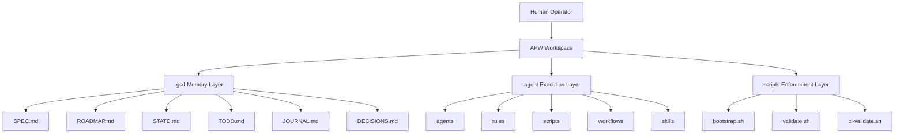
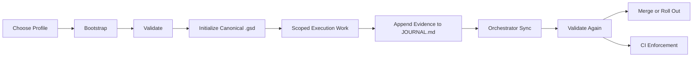
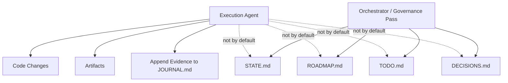
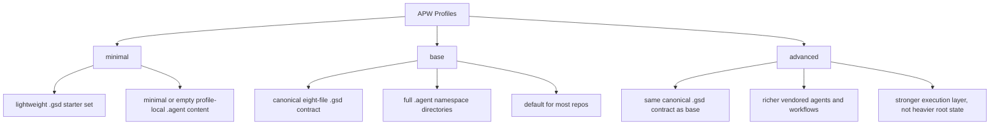
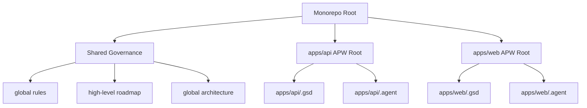

# DIAGRAMS.md — Visual Guide to APW

> [!TIP]
> Read this if you understand APW better with diagrams than with long explanations.

## What this is

This document shows APW visually.

It does not replace the contract docs.
It gives you the mental picture first, so the rest of the framework is easier to understand.

## Why it matters

APW can feel abstract until you can see:

- how `.gsd/` and `.agent/` relate
- where bootstrap and validation fit
- how canonical state stays controlled
- how profiles differ
- how APW works in a monorepo

## When to use it

Use this when:

- you are a visual learner
- you want to explain APW to someone quickly
- you want a mental model before reading the deeper docs

## Diagram 1: The APW Big Picture

### What it means

- `.gsd/` stores governed project memory
- `.agent/` stores execution support
- `scripts/` creates and enforces the workspace contract

## Diagram 2: Bootstrap to Delivery Flow

### What it means

This is the APW lifecycle in its simplest form.

Execution work happens in the middle, but governed state and validation surround it.

## Diagram 3: Controlled Canonical State Sync

### What it means

Execution agents can move fast, but official summary state is synchronized deliberately.

That is how APW reduces project-memory drift.

## Diagram 4: Profile Comparison

### What it means

The profile decision changes how much APW content is preloaded.
It does not change the core APW architecture.

## Diagram 5: Monorepo Pattern

### What it means

Monorepos should not force one root execution state to describe every app equally well.
APW works best when each meaningful execution root is bootstrapped and validated intentionally.

## Example

Example:

If you are explaining APW to a teammate, show Diagram 1 and Diagram 3 first.

Those two diagrams usually make the model click:

- APW has distinct layers
- canonical state is controlled, not casually rewritten

## What to read next

1. [START_HERE.md](./START_HERE.md)
2. [HOW_APW_WORKS.md](./HOW_APW_WORKS.md)
3. [REAL_WORLD_SCENARIOS.md](./REAL_WORLD_SCENARIOS.md)
