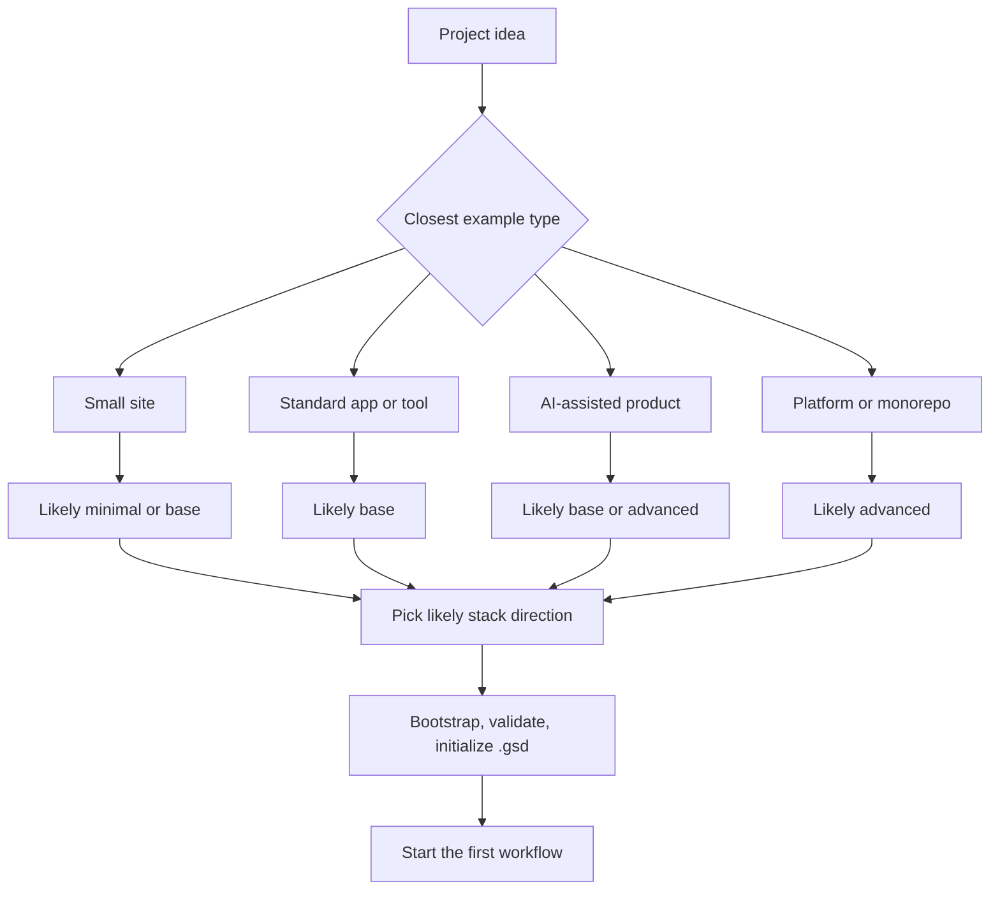
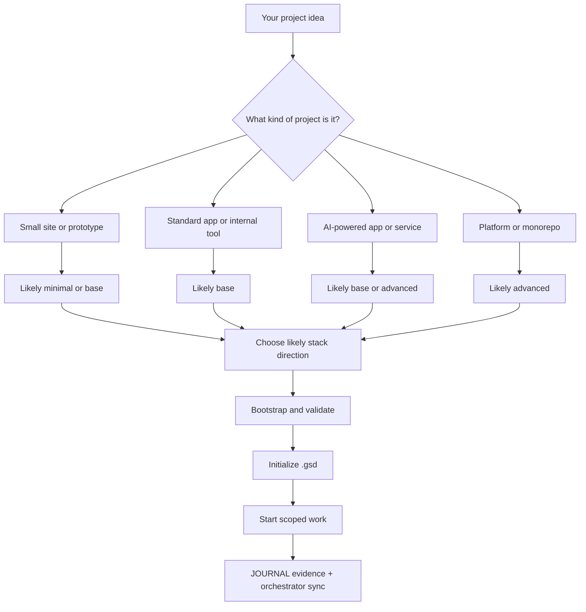

# REAL_WORLD_EXAMPLES.md — Real-World APW Examples

> [!IMPORTANT]
> Read this if you want to see how APW applies to the kinds of projects people actually want to build.

## What this guide is

This guide shows practical APW examples in plain English.

The point is not to lock you into one exact architecture.

The point is to help you answer questions like:

- "Can APW help with my kind of project?"
- "What would APW do first?"
- "Which profile would likely make sense?"
- "What stack direction would probably fit?"

Think of this as the "show me what it looks like in real life" guide.

## How to use this guide

Each example follows the same pattern:

- what the project idea is
- what the person is trying to achieve
- which APW profile is likely
- what stack direction is likely
- why that combination makes sense
- how APW helps the project get started
- where orchestrator use matters

These are recommendation patterns, not strict commands.

If your project looks somewhat like an example here, that is usually enough to help you pick a good starting path.

## Quick example map

| If your project looks like this | Likely profile | Likely stack direction | Likely first APW move | Complexity feel |
| :--- | :--- | :--- | :--- | :--- |
| personal portfolio or landing page | `minimal` or `base` | static site or lightweight web frontend | `/design` or `/create` after bootstrap | low |
| SaaS dashboard or admin tool | `base` | web frontend + backend API + database | `/status` then `/design` or `/create` | medium |
| appointment booking app | `base` | web app + backend API + database | `/create` around the first booking flow | medium |
| AI support chatbot | `advanced` or `base` | app/API layer + AI feature layer + database | `/brainstorm` then `/create` or `/orchestrate` | medium to high |
| internal reporting tool | `base` | dashboard or internal web app + backend + database | `/create` for the first reporting slice | medium |
| e-commerce prototype | `base` | storefront + backend/API + database | `/design` then `/create` | medium |
| backend API service | `base` | backend API + database or integrations | `/create` for the first endpoint set | medium |
| mobile product app | `base` or `advanced` | mobile app + backend API + database | `/design` then `/create` | medium to high |
| multi-service platform or monorepo | `advanced` | monorepo or multi-service setup | `/orchestrate` very early | high |

What this means:

- first find the example that feels closest to your project
- use that to choose a likely profile and stack direction
- then let APW turn that into a structured starting workflow

## Example: Personal portfolio or landing page

- **Idea:** A personal site that shows your work, background, and contact information.
- **Goal:** Publish a clean professional web presence without overcomplicating the project.
- **Recommended APW Profile:** `minimal` or `base`
- **Likely Stack Direction:** Static site or lightweight React / Next.js style frontend
- **Why this fits:** The project is content-heavy, usually small in scope, and often does not need a backend at first.
- **How APW helps first:** APW helps you clarify what pages matter, record the first scope in `.gsd`, bootstrap the repo cleanly, and start implementation without losing track of the site structure.
- **Likely first files/workflows:** `AGENTS.md`, `.gsd/SPEC.md`, `.gsd/ROADMAP.md`, `.gsd/TODO.md`, then `/design` or `/create`
- **When orchestrator matters:** Usually a little later, once the initial pages are built and the official status or next tasks need to be synchronized.
- **Next step:** Choose whether you want the lightest setup possible or a standard `base` setup, then bootstrap and validate.

## Example: SaaS dashboard or admin panel

- **Idea:** A dashboard where users or admins can log in, manage records, and work with application data.
- **Goal:** Build a real product surface with screens, workflows, and persistent data.
- **Recommended APW Profile:** `base`
- **Likely Stack Direction:** Web frontend + backend API + database
- **Why this fits:** Dashboards usually need both user-facing UI and server-side data handling. `base` gives strong project memory and governance without assuming the project already needs the richest possible execution bundle.
- **How APW helps first:** APW helps you clarify the first dashboard milestone, choose the initial user flows, bootstrap the workspace, validate it, and capture the current state and first tasks before implementation starts.
- **Likely first files/workflows:** `AGENTS.md`, `.gsd/SPEC.md`, `.gsd/STATE.md`, `.gsd/TODO.md`, then `/status`, `/design`, `/create`
- **When orchestrator matters:** Early and ongoing, because dashboards often generate a steady stream of evolving tasks, blockers, and milestone changes.
- **Next step:** Define the smallest usable dashboard version, choose `base`, and initialize the first `.gsd` state before building screens.

## Example: Appointment booking app

- **Idea:** A booking system where users can choose a time, make an appointment, and receive confirmation.
- **Goal:** Build a practical app that stores appointments and manages availability.
- **Recommended APW Profile:** `base`
- **Likely Stack Direction:** Web app + backend API + database
- **Why this fits:** Booking apps usually need persistent records, scheduling logic, and a real user-facing flow.
- **How APW helps first:** APW helps shape the first version around core booking behavior instead of trying to build the whole business at once. It also gives the project a clear task list and state model before code starts moving.
- **Likely first files/workflows:** `SPEC.md`, `ROADMAP.md`, `TODO.md`, `STATE.md`, then `/create`, `/test`, `/preview`
- **When orchestrator matters:** Fairly early, because once bookings, edge cases, and release readiness start to matter, controlled sync becomes important.
- **Next step:** Decide the smallest useful workflow, such as "pick time, submit booking, confirm success," then structure the repo around that first milestone.

## Example: AI support chatbot

- **Idea:** A support assistant that answers common customer questions and hands off harder cases.
- **Goal:** Deliver useful AI-assisted support without turning the project into uncontrolled prompt chaos.
- **Recommended APW Profile:** `advanced` or `base`
- **Likely Stack Direction:** Standard app or API layer plus an AI service feature layer and likely a database
- **Why this fits:** AI projects still need normal application structure. They often benefit from richer execution support, which is why `advanced` is often helpful, but a narrower prototype may still fit `base`.
- **How APW helps first:** APW keeps the business goal, support scope, task list, and AI implementation work tied together instead of scattering them across chats and experiments.
- **Likely first files/workflows:** `SPEC.md`, `ROADMAP.md`, `DECISIONS.md`, `TODO.md`, then `/brainstorm`, `/create`, `/test`, `/orchestrate` if the work spans multiple specialties
- **When orchestrator matters:** Usually early, because AI-related work can drift quickly and often involves cross-cutting choices that benefit from coordination.
- **Next step:** Decide whether the first version is a narrow support assistant or a more ambitious platform, then choose `base` or `advanced` accordingly.

## Example: Internal reporting or operations tool

- **Idea:** A tool for a business team to view reports, track work, or automate internal operations.
- **Goal:** Make internal work faster and more reliable.
- **Recommended APW Profile:** `base`
- **Likely Stack Direction:** Internal web app or dashboard + backend + database
- **Why this fits:** Internal tools benefit from structure and state tracking, but they usually do not need a huge architecture from day one.
- **How APW helps first:** APW helps you focus on the business job the tool needs to perform, choose a manageable first milestone, and keep evidence and progress organized as features are added.
- **Likely first files/workflows:** `STATE.md`, `TODO.md`, `SPEC.md`, then `/create`, `/enhance`, `/test`
- **When orchestrator matters:** Mostly when the tool starts evolving across multiple workstreams or when changing business priorities affect the project state.
- **Next step:** Define the first internal process the tool should improve, then bootstrap with `base` and keep the first scope narrow.

## Example: E-commerce prototype

- **Idea:** A first version of an online store with products, browsing, and early checkout behavior.
- **Goal:** Test whether the core shopping experience works before building a full commerce platform.
- **Recommended APW Profile:** `base`
- **Likely Stack Direction:** Web storefront + backend/API + database
- **Why this fits:** Even a prototype usually needs product data and some transaction logic, but the smartest move is usually to keep the architecture as simple as the first milestone allows.
- **How APW helps first:** APW encourages you to define what the prototype actually proves, then build around that goal instead of overbuilding future complexity.
- **Likely first files/workflows:** `SPEC.md`, `ROADMAP.md`, `TODO.md`, then `/design`, `/create`, `/test`, `/preview`
- **When orchestrator matters:** Once the prototype starts affecting roadmap decisions, release readiness, or next milestone planning.
- **Next step:** Define the first shopping journey you need to prove, then keep the implementation scoped to that journey.

## Example: Backend API service

- **Idea:** A service that exposes endpoints, handles data, or powers another app.
- **Goal:** Build a reliable backend with clear data and integration behavior.
- **Recommended APW Profile:** `base`
- **Likely Stack Direction:** Backend API + database or integrations
- **Why this fits:** Backend services are often straightforward in shape, but they still benefit from APW's project memory, scoped workflows, and verification habits.
- **How APW helps first:** APW keeps the service scope, endpoint plan, and next tasks visible so the project does not become a pile of endpoint changes with no shared story.
- **Likely first files/workflows:** `SPEC.md`, `ARCHITECTURE.md`, `TODO.md`, then `/create`, `/debug`, `/test`
- **When orchestrator matters:** Mostly when service milestones, blockers, or interface decisions need to be synchronized into canonical state.
- **Next step:** Define the first endpoints or service behavior that matter, then record them clearly in `.gsd` before implementation starts.

## Example: Mobile app

- **Idea:** A product people mainly use on a phone or tablet.
- **Goal:** Deliver a useful mobile experience while keeping the project organized.
- **Recommended APW Profile:** `base` or `advanced`
- **Likely Stack Direction:** Mobile app such as Flutter plus backend API and database where needed
- **Why this fits:** Mobile projects often still need server-side logic, accounts, and sync, so they are usually more than "just a frontend."
- **How APW helps first:** APW keeps the product scope, first screens, and supporting backend work tied together so the project does not split into disconnected pieces.
- **Likely first files/workflows:** `SPEC.md`, `ROADMAP.md`, `STATE.md`, then `/design`, `/create`, `/test`
- **When orchestrator matters:** Early if the project includes both app and backend work, and increasingly as release planning and verification matter more.
- **Next step:** Decide the smallest useful mobile experience, then choose whether the project feels like a standard `base` app or something that deserves `advanced` support.

## Example: Monorepo with frontend + backend + shared packages

- **Idea:** A broader platform with multiple apps or services that need to evolve together.
- **Goal:** Coordinate a larger system without losing local clarity or state control.
- **Recommended APW Profile:** `advanced`
- **Likely Stack Direction:** Monorepo or multi-service setup with frontend, backend, and shared packages where genuinely needed
- **Why this fits:** This is the kind of project that benefits from richer execution support and deliberate coordination early.
- **How APW helps first:** APW helps you treat the system as a structured platform instead of a collection of disconnected repos or tasks. It also makes orchestrator-guided decomposition much more practical.
- **Likely first files/workflows:** `ROADMAP.md`, `ARCHITECTURE.md`, `DECISIONS.md`, `TODO.md`, then `/orchestrate`, `/create`, `/test`
- **When orchestrator matters:** Very early and very often, because cross-cutting state sync and task decomposition are part of the normal workflow.
- **Next step:** Confirm that the project really needs a multi-service shape, then plan the first delivery slice carefully instead of modeling the entire platform at once.

## Side-by-side comparison: Simple prototype vs broader product

| Situation | Simpler path | Broader path |
| :--- | :--- | :--- |
| personal site or small prototype | `minimal` or `base`, one frontend, small scope | rarely needs broader structure early |
| normal app or dashboard | `base`, frontend + backend if needed | `advanced` only if complexity is already obvious |
| AI product | `base` if the first version is narrow | `advanced` if AI + app + multiple workstreams appear early |
| platform or monorepo | usually not needed for a prototype | `advanced`, orchestrator-led coordination, multi-service planning |

Main lesson:

- if you are proving a small idea, start smaller
- if you already know the project has long-term complexity, choose stronger structure earlier

## Visual guide

What this means:

- first identify the kind of project
- then choose a fitting profile
- then choose a sensible stack direction
- then let APW turn that into a structured working project

## The safest way to use these examples

If you are unsure which example matches you:

1. Find the example that feels closest.
2. Borrow its likely profile and stack direction as a starting point.
3. Start simpler if you are still uncertain.
4. Let the project grow into more complexity only when the work really needs it.

That is usually much safer than trying to predict the final architecture on day one.

## What to do next

- Read [APW_FOR_BEGINNERS.md](./APW_FOR_BEGINNERS.md) for the broad plain-English intro.
- Read [IDEA_TO_PROJECT_GUIDE.md](./IDEA_TO_PROJECT_GUIDE.md) for the full journey from idea to structured project.
- Read [TECH_STACK_SELECTION_GUIDE.md](./TECH_STACK_SELECTION_GUIDE.md) for stack-direction and profile selection help.
- Read [QUICK_START.md](./QUICK_START.md) when you are ready to bootstrap a repo.
- Read [COMMAND_INVOCATION_GUIDE.md](./COMMAND_INVOCATION_GUIDE.md) when you are ready to drive work inside the project.
- If you want deeper scenario-style APW behavior, also read [REAL_WORLD_SCENARIOS.md](./REAL_WORLD_SCENARIOS.md).
