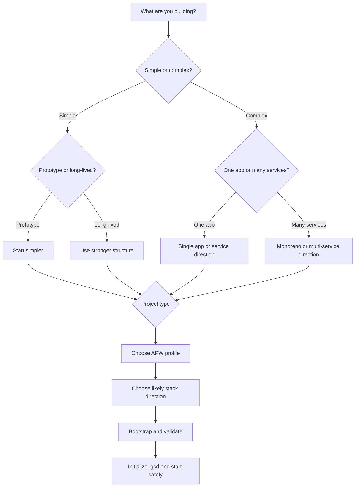

# TECH_STACK_SELECTION_GUIDE.md — Choosing a Practical Tech Stack Direction

> [!IMPORTANT]
> Read this if you know what you want to build, but you are not sure what stack direction or APW profile makes the most sense.

## I have an idea, but not a tech stack

This is a very normal place to be.

Many people know the product or project they want before they know the technical shape.

Typical beginner questions sound like this:

- "I know what I want to build, but I do not know the tech stack."
- "Do I need a website, a web app, a mobile app, or a backend service?"
- "Do I need a database?"
- "Do I need AI features, or just a normal app?"
- "Should I choose `minimal`, `base`, or `advanced`?"
- "I want APW to help me pick a practical direction without making it too complicated."

This guide is for that moment.

It is not a low-level architecture handbook.
It is a practical direction guide for choosing a sensible starting shape.

## The big idea

You usually do **not** need the perfect stack on day one.

What you do need is:

- a project type you can describe clearly
- a likely stack direction
- an APW profile that fits the size and complexity of the work

In other words:

- choose the shape first
- choose the details later

APW helps by giving you a stable project structure no matter which reasonable stack direction you choose.

## How to think about stack choice

Before you pick technologies, ask these simpler questions:

### What kind of thing am I building?

Examples:

- a small website
- a web app
- a backend API
- an AI-powered service
- a mobile app
- an internal tool
- a multi-service platform

### Is this a prototype or something more serious?

If it is an early prototype, start simpler.

If it is likely to grow into a longer-lived product, choose a stronger APW profile and a stack direction that will be easier to extend.

### Am I working alone or with a team?

Solo projects can often start simpler.

Team projects usually benefit from stronger structure earlier, because handoff and shared understanding matter more.

### Is this one app or many services?

A lot of beginners overcomplicate this.

If one app or one service can do the job, start there.
You usually do **not** need many services at the beginning unless the project really demands it.

### Do I need AI features or just normal app features?

Sometimes a project sounds like an "AI app" when it is really a normal app plus a small AI feature.

That distinction matters.

If most of the system is still standard product work, keep the stack direction simple and treat AI as one feature layer.

## Understanding APW profiles

APW profiles are about how much structure and built-in execution support you want in the repo.

They are not separate frameworks.

### `minimal`

#### What it is for

The lightest APW setup.

#### When to choose it

Choose `minimal` when:

- the project is very small
- you want the lightest structure possible
- you are testing an idea quickly
- you do not need rich vendored specialist agent material yet

#### What kind of project it fits

- portfolio site
- landing page
- tiny prototype
- lightweight research or experiment repo

#### What level of structure it brings

It still gives you APW structure, but with a lighter footprint.

#### Simple example

"I just want a personal portfolio site and I do not need a heavy setup."

### `base`

#### What it is for

The standard APW setup for most real projects.

#### When to choose it

Choose `base` when:

- you want the normal APW experience
- the project has real milestones
- you expect ongoing work over time
- you want strong project memory without the richest execution bundle

#### What kind of project it fits

- web apps
- dashboards
- booking apps
- internal tools
- early SaaS products
- standard backend services

#### What level of structure it brings

It gives you the core APW memory and governance model in the most generally useful form.

#### Simple example

"I am building a real app, and I want APW to help me keep it organized from the start."

### `advanced`

#### What it is for

The same core APW project-memory contract as `base`, but with richer specialist execution content vendored into `.agent/`.

#### When to choose it

Choose `advanced` when:

- you expect a more complex project
- you want richer specialist agents and workflows early
- the project is likely to involve multiple kinds of work across time
- you want stronger execution support from the beginning

#### What kind of project it fits

- AI-powered services
- broader product platforms
- multi-area application work
- more involved team delivery
- systems that are likely to grow quickly

#### What level of structure it brings

It does **not** change the core `.gsd` contract.
It strengthens the execution layer.

#### Simple example

"This project will probably involve frontend, backend, testing, and AI-related work, and I want richer support from day one."

## Quick profile rule of thumb

Use this simple rule:

- choose `minimal` if the project is tiny and intentionally lightweight
- choose `base` if you are not sure
- choose `advanced` if you already expect more complexity or richer execution needs

For many beginners, `base` is still the safest default.

## Common project categories

This section helps map project type to a practical stack direction.

These are recommendation patterns, not hard rules.

## Small website or landing page

### What this usually means

A mostly content-focused site with a few pages, light interactivity, and little or no backend logic.

### Likely stack direction

- static site or lightweight web frontend
- React / Next.js style frontend if you want a modern component-based web approach
- little or no backend at first

### Likely APW profile

- `minimal` or `base`

### Common tradeoffs

- simple and fast to start
- easier to maintain
- may not need a database at all

### When not to overcomplicate it

Do not add a backend, database, or monorepo unless the site truly needs them.

## Web application / dashboard / SaaS

### What this usually means

A user-facing product with screens, state, business logic, and often logins, data, and workflows.

### Likely stack direction

- web frontend such as React / Next.js style app
- backend API such as FastAPI or Node-based API
- database such as PostgreSQL when data matters

### Likely APW profile

- usually `base`
- sometimes `advanced` if complexity is expected early

### Common tradeoffs

- more moving parts than a simple website
- stronger long-term flexibility
- often benefits from a clear separation between frontend and backend

### When not to overcomplicate it

If you are only proving the core idea, keep the first version small.
Do not build five services when one frontend and one backend will do.

## Backend API / service

### What this usually means

A project where the main product is logic, data handling, integrations, or service endpoints rather than a big user-facing UI.

### Likely stack direction

- backend API such as FastAPI or Node backend
- PostgreSQL or another database if persistent data matters
- optional lightweight admin or test client later

### Likely APW profile

- usually `base`
- `advanced` when integrations or complexity are high

### Common tradeoffs

- simpler UI needs
- stronger focus on data, integrations, and reliability
- easier to keep small if the scope stays focused

### When not to overcomplicate it

If your product is one service, start with one service.
You do not need microservices just because the word "API" is involved.

## AI / ML or LLM-powered service

### What this usually means

A product where AI is part of the user value, such as chat, summarization, support assistance, or classification.

### Likely stack direction

- standard app or API layer
- AI service layer or AI feature integration
- database if you need users, logs, documents, or state
- frontend only if users need an interface

### Likely APW profile

- often `advanced`
- sometimes `base` for a narrower prototype

### Common tradeoffs

- easy to let scope expand too fast
- usually still depends on a lot of normal app structure
- benefits from stronger orchestration and execution support

### When not to overcomplicate it

Do not treat every AI feature like a giant platform requirement.
Sometimes the practical first step is just a normal app plus one focused AI capability.

## Mobile app

### What this usually means

A product that users mainly experience on a phone or tablet.

### Likely stack direction

- mobile app direction such as Flutter
- backend API if the app needs accounts, sync, or business logic
- database if data must persist across users or devices

### Likely APW profile

- `base` for many normal mobile projects
- `advanced` if mobile + backend + other complexity appear early

### Common tradeoffs

- more attention to platform-specific experience
- often still needs backend services
- testing and release flow can become important quickly

### When not to overcomplicate it

If the first goal is to prove the product, keep the initial mobile scope tight.

## Internal tool or automation system

### What this usually means

A tool used by a business or team to save time, organize work, or automate a process.

### Likely stack direction

- lightweight web app or dashboard
- backend service or automation scripts
- database if the tool tracks meaningful data over time

### Likely APW profile

- usually `base`
- `advanced` if the automation spans many moving parts

### Common tradeoffs

- often easier to start than a public-facing product
- can still become important quickly if the business relies on it
- tends to benefit from strong state tracking and validation

### When not to overcomplicate it

Many internal tools do not need elaborate architecture at the start.
Focus on usefulness first.

## Monorepo or multi-service platform

### What this usually means

A larger setup with multiple apps or services that need to evolve together.

### Likely stack direction

- monorepo structure
- multiple frontend/backend services where actually needed
- shared packages or utilities
- databases and integrations depending on platform needs

### Likely APW profile

- usually `advanced`

### Common tradeoffs

- strongest long-term flexibility
- more coordination overhead
- much easier to make too complex too early

### When not to overcomplicate it

Do not choose this just because it sounds more professional.
Use it when the project really has multiple apps or services that must live together.

## Practical decision helpers

### Do I need just a frontend, or frontend + backend?

Use just a frontend when:

- the project is mostly static or content-driven
- there is little or no user-specific data
- there is little business logic on the server side

Use frontend + backend when:

- users need accounts
- the product stores or manages data
- you need server-side business logic
- external integrations or protected operations matter

### Do I need a database?

You probably need a database when:

- users create or save data
- records must persist over time
- the system tracks business objects such as bookings, tasks, reports, or customers

You may not need one yet when:

- the project is a static site
- the first version is mostly presentation
- the prototype is extremely lightweight

### Do I need AI features, or standard app features?

Ask:

- Is AI the main product value?
- Or is it just one feature inside a normal product?

If AI is only one feature, keep the overall stack direction simple and add the AI layer where it actually matters.

### Prototype or production-oriented?

If it is mainly a prototype:

- start simpler
- use fewer moving parts
- avoid architecture that only helps future scale

If it is likely to become a real long-term product:

- use a stronger profile earlier
- choose a stack direction that will be easier to extend
- keep governance and validation habits strong from the start

### Solo or team?

If you are solo:

- simpler often wins
- `minimal` or `base` may be enough

If you have a team:

- stronger shared structure helps more
- `base` or `advanced` is often more practical

### One service or many services?

Start with one service unless there is a clear reason not to.

Multiple services make sense when:

- there are truly separate responsibilities
- different parts of the system need to evolve independently
- the project is already clearly multi-system in nature

## Comparison table

| Project type | Likely profile | Likely stack direction | Complexity level | Team size fit |
| :--- | :--- | :--- | :--- | :--- |
| Personal portfolio site | `minimal` or `base` | static site or lightweight web frontend | low | solo or small |
| Small landing page | `minimal` | static site or lightweight frontend | low | solo or small |
| Admin dashboard | `base` | frontend + backend API + database | medium | solo or team |
| Appointment booking app | `base` | web app + backend API + database | medium | solo or team |
| AI support chatbot | `advanced` or `base` | app/API layer + AI service feature layer + database | medium to high | solo or team |
| Internal reporting tool | `base` | web frontend or dashboard + backend + database | medium | team-friendly |
| Mobile product app | `base` or `advanced` | mobile app + backend API + database | medium to high | solo or team |
| Multi-service platform | `advanced` | monorepo or multi-service setup | high | team |

## Example recommendations

### Personal portfolio site

- likely profile: `minimal` or `base`
- likely stack direction: static site or lightweight React / Next.js style frontend
- why it fits: the project is small, presentation-heavy, and usually does not need a backend early

### Admin dashboard

- likely profile: `base`
- likely stack direction: web frontend + backend API + PostgreSQL-style database
- why it fits: dashboards usually need user-facing screens, data handling, and business logic

### AI support chatbot

- likely profile: `advanced` or `base`
- likely stack direction: standard app or API layer plus an AI service layer and likely a database
- why it fits: the AI feature matters, but the system still needs normal product structure around it

### Appointment booking app

- likely profile: `base`
- likely stack direction: web app + backend API + database
- why it fits: bookings are data-driven, user-facing, and usually need persistent records

### E-commerce prototype

- likely profile: `base`
- likely stack direction: web storefront + backend/API + database
- why it fits: even a prototype usually needs product, cart, or order data, but it should still start simpler than a full platform

### Internal reporting tool

- likely profile: `base`
- likely stack direction: dashboard frontend + backend service + database
- why it fits: internal tools often benefit from strong structure without needing a huge platform design

### Multi-service platform

- likely profile: `advanced`
- likely stack direction: monorepo or multi-service setup with shared tooling where needed
- why it fits: the project already implies coordination across multiple services or applications

## Visual decision flow

What this means:

- first decide the general project shape
- then choose how strong your APW setup should be
- then choose a likely stack direction
- then start the project in a structured way

## The safest beginner advice

If you are unsure:

1. Choose the simplest stack direction that can honestly support the first useful version.
2. Choose `base` unless you have a good reason for `minimal` or `advanced`.
3. Treat AI as a feature layer unless it truly changes the whole product shape.
4. Avoid many services unless the project clearly needs them.
5. Let the project grow into complexity instead of starting with maximum complexity.

## What to do next

- Read [IDEA_TO_PROJECT_GUIDE.md](./IDEA_TO_PROJECT_GUIDE.md) to place stack choice inside the full idea-to-project journey.
- Read [QUICK_START.md](./QUICK_START.md) when you are ready to bootstrap a real repo.
- Read [APW_FOR_BEGINNERS.md](./APW_FOR_BEGINNERS.md) if you want the broader APW introduction first.
- Read [COMMAND_INVOCATION_GUIDE.md](./COMMAND_INVOCATION_GUIDE.md) once implementation begins.
- If APW later adds `REAL_WORLD_EXAMPLES.md`, use it as the scenario companion to this guide. For now, [REAL_WORLD_SCENARIOS.md](./REAL_WORLD_SCENARIOS.md) is the closest match.
