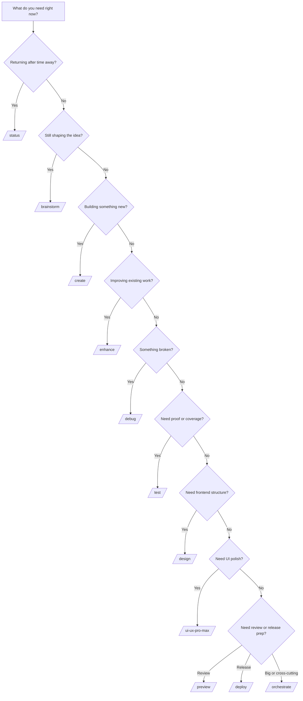

# WORKFLOW_SELECTION_GUIDE.md — How To Choose The Right Workflow

> [!TIP]
> Read this when you are staring at the repo and thinking: "Which command should I use right now?"

## Start here

If you are unsure, start with:

1. `AGENTS.md`
2. `/status`

That is the safest default.

## Workspace context note

These workflow choices are for normal project work inside a downstream project root.

That means:

- open the downstream project in your IDE
- start from that repo's `AGENTS.md`
- run project workflows there

Do not treat APW root or the workspace parent folder as the normal home for these project workflows.

If you want the location model in one page, read [WHERE_DO_I_WORK.md](./WHERE_DO_I_WORK.md).
If you want the explicit switch helpers, read [SAFE_CONTEXT_SWITCHING.md](./SAFE_CONTEXT_SWITCHING.md).
If you want the first-run IDE checklist first, read [FIRST_RUN_IN_IDE.md](./FIRST_RUN_IN_IDE.md).

## Important scope note

These are the standard APW execution workflows vendored into downstream `base` and `advanced` repos as the shared core command pack.

If your downstream repo uses `minimal`, keep the same operator logic, but confirm that the local workflow file actually exists before relying on it.

`advanced` may also vendor additional workflows such as `/design`, `/preview`, `/deploy`, and `/ui-ux-pro-max`.

## Fresh repo note

If this is a brand-new repo, do not jump straight from bootstrap into command use while the core `.gsd` files are still template shells.

Run:

```bash
/path/to/apw/scripts/init-project-state.sh --target .
```

Then choose the first workflow from the now-real project context.

## The fast chooser

| If your situation sounds like this | Use | Good first agent | Usually next |
| :--- | :--- | :--- | :--- |
| "I am coming back after a break." | `/status` | `@orchestrator` | `/create`, `/debug`, or `/orchestrate` |
| "I have an idea but not a plan." | `/brainstorm` | `@product-manager` or `@project-planner` | GSD `/plan`, `/design`, or `/create` |
| "I need to build something new." | `/create` | domain specialist | `/test`, `/preview`, then orchestrator sync if needed |
| "The code works but needs cleanup or polish." | `/enhance` | domain specialist or `@code-archaeologist` | `/test` or `/preview` |
| "Something is broken." | `/debug` | `@debugger` or domain specialist | `/test`, then maybe orchestrator sync |
| "I need proof before I call this done." | `/test` | `@test-engineer` or `@qa-automation-engineer` | orchestrator sync if completion changes official state |
| "I need structure before coding." | `/design` | `@frontend-specialist`, `@project-planner`, or relevant specialist | `/create` or `/ui-ux-pro-max` |
| "The UI needs high polish." | `/ui-ux-pro-max` | `@frontend-specialist` | `/preview` and `/test` |
| "I need a review-ready build or local URL." | `/preview` | `@devops-engineer` | `/debug`, review, or `/deploy` |
| "I am preparing a release." | `/deploy` | `@devops-engineer` | orchestrator sync |
| "This task is too large or crosses multiple areas." | `/orchestrate` | `@orchestrator` | orchestrator-managed execution and sync |



What this means:

- start by naming the kind of problem you have
- choose the workflow that matches that problem
- escalate to `/orchestrate` when one clean direct workflow is no longer enough

## Beginner decision paths

### I am returning after time away

Use `/status`.

Why:

- it gets you back into the repo safely
- it reads the current project memory first
- it tells you what to do next instead of making you guess

### I have an idea but I do not know the shape yet

Use `/brainstorm`.

Why:

- it helps you compare options before implementation
- it keeps you from coding the first idea that came to mind
- it gives you a recommendation you can later turn into planning or execution

### I need to build something new

Use `/create`.

Why:

- this is the direct build workflow
- it should be tied to `SPEC.md`, `TODO.md`, and current scope
- it is the right move once the work is already defined

### The code works but it is messy or underpowered

Use `/enhance`.

Why:

- it is for improving existing implementation
- it keeps you in bounded scope
- it is safer than pretending every improvement is a brand-new feature

### Something is broken

Use `/debug`.

Why:

- it forces a reproduce-investigate-fix mindset
- it pushes toward root cause instead of random edits
- it naturally pairs with `/test` after the fix

### I need proof before I close the task

Use `/test`.

Why:

- APW closes work with evidence, not optimism
- `/test` is the operator workflow that makes verification explicit

### I need structure before implementation

Use `/design`.

Why:

- it helps with component boundaries, page layout, interfaces, and sequencing
- it is the right middle step between vague ideas and direct code generation

### I need the UI to feel finished, not merely functional

Use `/ui-ux-pro-max`.

Why:

- it is for polish, hierarchy, responsiveness, interaction quality, and design-system refinement
- it should come after the basic structure already exists

### I need to review the work locally

Use `/preview`.

Why:

- it gets you to a reviewable build or local URL
- it is the safe step before release

### I need release preparation or deployment

Use `/deploy`.

Why:

- it turns release work into an explicit workflow
- it is where pre-flight checks, environment targeting, and rollout verification belong

### The task is too big for one clean execution pass

Use `/orchestrate`.

Why:

- it is for work that crosses files, modules, or specialties
- it is the right choice when TODO-based work needs decomposition
- it is how APW makes orchestrator involvement practical instead of vague

## The easiest rule of thumb

Use this order:

1. If you are unsure, run `/status`.
2. If you still do not know the solution, use `/brainstorm`.
3. If you know the solution but need structure, use `/design`.
4. If you know what to build, use `/create`.
5. If it is broken, use `/debug`.
6. If it is built, verify with `/test`.
7. If it needs a human look, use `/preview`.
8. If it is cross-cutting, escalate to `/orchestrate`.

## When to escalate to `/orchestrate`

Go to `/orchestrate` when any of these are true:

- one command would touch too many domains at once
- backend, frontend, and tests all need coordination
- the TODO item is too large to execute as one bounded step
- the work needs explicit sub-agent assignment
- the task will likely require canonical state sync after multiple execution steps

## Typical mini-loops

### New feature loop

`/status` → `/create` → `/test` → `/preview` → orchestrator sync when official state changes

### Bug-fix loop

`/status` → `/debug` → `/test` → orchestrator sync if blockers or next steps changed

### UI improvement loop

`/status` → `/design` → `/ui-ux-pro-max` → `/preview` → `/test`

### Large cross-cutting loop

`/status` → `/orchestrate` → specialist execution → orchestrator sync

## What happens after a workflow ends

A workflow usually ends in one of four ways:

1. It recommends the next command.
2. It appends bounded evidence to `.gsd/JOURNAL.md`.
3. It asks for human review or approval.
4. It triggers an orchestrator handoff because canonical state must change.

That is normal in APW.

The execution workflow does not need to do everything itself.

## What to read next

- Read [COMMAND_INVOCATION_GUIDE.md](./COMMAND_INVOCATION_GUIDE.md) next to see what each workflow should read, produce, and hand off.
- Then read [AGENT_PLUS_WORKFLOW_EXAMPLES.md](./AGENT_PLUS_WORKFLOW_EXAMPLES.md) to see the real `@agent /workflow task` pattern in practice.
- If you need the faster beginner map again, read [START_HERE.md](./START_HERE.md).
